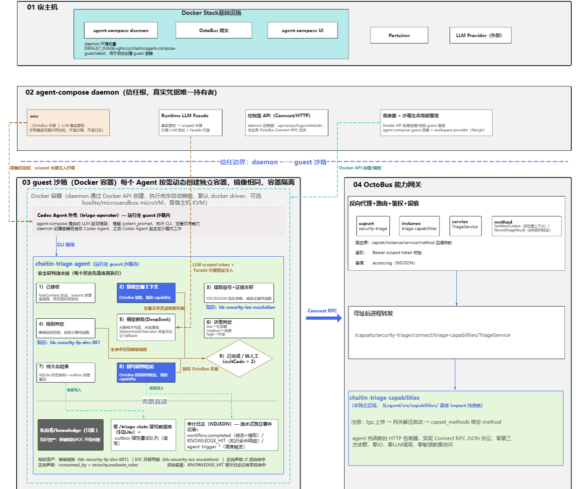
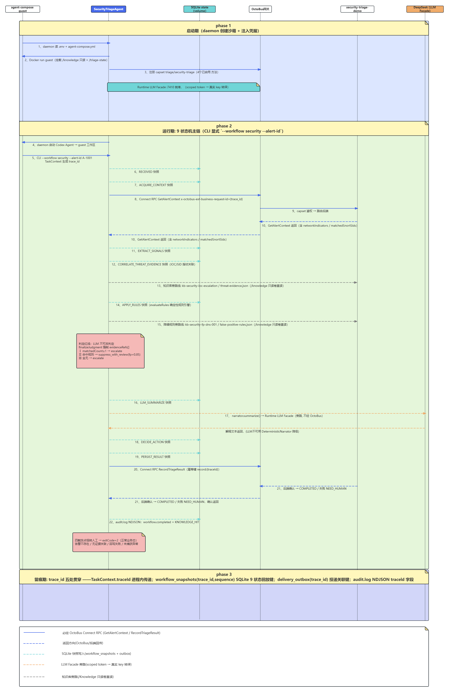

# 安全运营方向-安全告警降噪研判（Chaitin Triage Agent）

**服务器环境：**

> - **登录地址**：`8.147.68.154`
> - **用户名**：`root`
> - **端口**：`22`

## 场景：

SOC 每天被海量告警淹没，授权扫描、已知误报等重复噪音持续消耗分析师精力。本 Agent 聚焦**安全告警降噪研判**这一条有界工作流：接收告警 ID 后经 OctoBus 取数，先与私有威胁证据做 IOC 关联，再按结构化降噪规则判定误报（如授权漏扫 DNS 活动 → 误报分 0.85，抑制并复核），结论回写并发送企业微信脱敏通知，证据不足则显式转人工。整条链路"触发→取数→判定→处置→留痕"五阶段闭环，结论只由确定性规则与证据关联产出，模型仅解释、不改决策。

## 预期价值：

在**降误报**与**控漏报**之间建立可审计的自动化平衡：

- **降噪提效**：确定性规则压制已知误报模式，分析师只看值得看的告警；
- **漏报可控**：IOC 命中即升级研判，证据不足一律 fail-closed 转人工，绝不静默丢弃；
- **可解释可回放**：结论强制携带 evidenceRefs，traceid 贯穿 SQLite 快照、审计日志与网关 access.log，任意研判可完整复盘；
- **知识沉淀**：降噪规则结构化入库，支持消融自检与知识-代码双向绑定，运营经验持续积累；
- **合规内生**：状态最小化、通知脱敏、私有 IOC 绝不导出、凭据不出 daemon。

***

## 1. 架构图

**1）在线地址(高清)：**<https://www.processon.com/view/link/6a92fbf88d56e8392bab2185>

**2）架构图：**



### 3）关键架构要点

1. **guest 沙箱就是 Docker 容器** — daemon 通过 Docker API 创建 `agent-compose-guest` 镜像的容器，挂载卷与工作区后启动 Codex Agent。支持三种生命周期：`--rm`（用完即销毁，适合 cron）、默认停止保留（可 resume）、`--keep-running`（支持多轮 `exec`，适合交互）。安全告警研判为单轮任务用 `--rm`，连续研判多告警用 `--keep-running` 更高效。
2. **Docker Stack 只编排常驻容器**（daemon / 网关 / UI / Portainer），不含业务镜像 — `DEFAULT_IMAGE` 是 daemon 的环境变量而非 Stack 声明，installer 预拉 guest 镜像避免首次卡在大文件下载；agent 代码通过 workspace provider（file/git）按需进入 guest 容器。
3. **Codex Agent 与 chaitin-triage-agent 都在 guest 容器内** — daemon 只负责创建容器和启动 Codex Agent，之后 Codex Agent 靠 LLM 理解 system\_prompt 自主决策执行什么 CLI。system\_prompt 锁死命令格式（`cd agent && node src/interfaces/cli.js --workflow security --alert-id <id>`），LLM 只能填 `<id>` 值不能发明新参数；`--workflow` 选项只来自显式 flag，不受 prompt 文本影响。
4. **研判流水线 9 状态：每状态先落库（SQLite 快照）再执行** — `#transition()` 先 `stateStore.save()` 写 SQLite 标记阶段起点，落库成功才执行该阶段业务逻辑，失败则回滚抛异常。快照含 `traceId / sequence / state / payload`，进程崩溃后运维从最后一条快照即可完整重建运行。
5. **转人工四触发点**：
(1) 告警不存在或取数失败 
(2) 未命中任何降噪规则
(3) 回写 OctoBus 失败
(4) 任何未捕获异常 — 全部走 `exitCode=2`，这不是故障是设计行为。
6. **知识资产参与判定**：`kb-security-ioc-escalation`（证据关联）+ `kb-security-fp-dns-001`（降噪规则）— 正向 `consumed_by` 声明被谁消费，反向 `KNOWLEDGE_HIT` 审计日志记录实际命中，双向核对证明知识真实参与；消融开关 `KNOWLEDGE_ABLATION` 可按 `knowledge_id` 关闭知识注入，被消融知识跳过判定并打 `ablated` 标记。
7. **LLM 只解释不判定** — `narrator.summarize()` 不影响 `decision.status`，判定只能来自确定性规则 `evaluateRules()` 或私有证据关联 `correlateThreatEvidence()`；LLM 异常时降级 `DeterministicNarrator`，`narrativeSource` 置 `"fallback"`，禁止静默失败。
8. **chaitin-triage-capabilities 是 agent 纯函数的 HTTP 包装器** — 同仓库跨进程 import，基于 `node:http` 零第三方依赖，每个 method 都是确定性纯函数（零 IO · 零 LLM · 零敏感数据）。
9. **四条通道严格区分，真实密钥从不进沙箱** —
   | 通道                 | 路径                               | 凭据                             |
   | ------------------ | -------------------------------- | ------------------------------ |
   | OctoBus 业务能力       | 沙箱 → OctoBus 网关（直连，不经 daemon）    | scoped token                   |
   | LLM 调用             | 沙箱 → daemon Facade → 外部 provider | scoped token（真实 key 只在 daemon） |
   | SQLite 状态持久化       | 沙箱内本地卷 `/triage-state`（不经网络）     | 无                              |
   | 知识卷直读            | 沙箱内本地卷 `/knowledge`（只读挂载，不经网络）   | 无                              |

   前两条是跨信任边界的外部通道，后两条是沙箱内本地通道。LLM provider key、OctoBus 管理令牌、daemon AUTH\_TOKEN 全部只在 daemon `.env`（0600 权限），沙箱内只有 scoped token。
10. **多个 Agent 各有独立 guest 容器** — 共用同一个 `agent-compose-guest` 镜像，但各自独立容器，隔离 scoped token、隔离卷（知识卷只读可共享，状态卷按 agent 隔离）、隔离 workspace 路径、隔离 system\_prompt。
11. **信任边界：daemon 持全部真实凭据，guest 沙箱零真实凭据** — daemon `.env`（0600）存 LLM provider key / OctoBus 管理令牌 / AUTH\_TOKEN；沙箱只有 scoped token，真实密钥从文件系统、环境变量、网络三个层面都不进入 guest。
12. **trace\_id 全链路贯穿** — 从 TaskContext 生成 `traceId` 开始，SQLite 快照、NDJSON audit.log、OctoBus access.log（`x-octobus-ext-business-request-id`）四处同 ID 贯穿，任意时刻可按 traceId 回放完整运行链路。

***

## 2. 业务逻辑分层（调用链视图：八层映射 + trace_id 全链路贯穿）

左侧=流水线五阶段主线（触发→编排→判定→处置→留痕）；右侧=三条支撑通道（能力总线/知识库/LLM narrator）；底部=trace_id 锚点。
调用形式：`--workflow security --alert-id <id>`（scheduler cron `0 * * * *` 安全边界巡检）。

### 左侧主线：五阶段流水线

| 模块 | 本项目实现 | 调用链与约束 |
| --- | --- | --- |
| **① 触发层** | `agent/src/interfaces/cli.js` + `security-cli.js`（组合根）· `agent-compose.yml` scheduler · `domains/task/task-context.js` | 工作流选择只来自显式 CLI flag `--workflow`，prompt 永远不能选择权限；触发即生成标准化 `TaskContext`：`traceId` / `taskId` / `workflow` / `trigger` / `subject{alertId}` / `createdAt`（幂等键），`taskId === traceId` 贯穿全链路。malware 入参（--sample-id / --sha256 等）一律抛错拒绝。环境变量别名 `SECURITY_TRIAGE_* → TRIAGE_*` 在此统一装配。 |
| **② 编排层** | `agent/src/application/pipelines/security-triage-pipeline.js`（`SecurityTriageAgent.triage()`）· `shared/run-metrics.js` | 固化 9 状态机：`RECEIVED → ACQUIRE_CONTEXT → EXTRACT_SIGNALS → CORRELATE_THREAT_EVIDENCE → APPLY_RULES → LLM_SUMMARIZE → DECIDE_ACTION → PERSIST_RESULT → {COMPLETED / NEED_HUMAN}`；**每次状态迁移 #transition() 先 SQLite 快照落库再执行业务逻辑**，失败回滚抛异常。终态指标 `run-metrics`：`stage_durations{state→ms}` / `capability_calls` / `capability_failures` / `knowledge_hits` / `narrative_source` / `manual_escalation`，任务终态挂到 `result.metrics`。 |
| **③ 判定层** | `capabilities/security/rule-engine.js`（`evaluateRules()`）· `capabilities/security/threat-evidence.js`（`correlateThreatEvidence()` + `decisionFromThreatCorrelation()`）· `domains/judgment/judgment.js`（`finalizeJudgment()` 补齐 evidenceRefs） | **结论只由确定性规则 / 私有证据关联产出，红线：LLM 不可改判定**。<br>Ⅰ 降噪规则匹配：`kb-security-fp-dns-001` 命中 → `suppress_with_review`（`falsePositiveScore=0.85`），证据缺失走 `manual_review / request_missing_evidence`（不静默通过）；<br>Ⅱ IOC/SID 指纹关联：`correlateThreatEvidence()` 将 `networkIndicators` + `matchedSnortSids` 与私有登记册做确定性匹配，`matchedCount >= 1` 时优先级高于降噪规则 → `open_case`；<br>Ⅲ 规则全无命中 → `escalate / open_case`（高优先级人工）。<br>所有结论经 `finalizeJudgment()` 强制补齐 `evidenceRefs[]`，**无证据引用的结论按规范无效**。 |
| **④ 处置层** | `infrastructure/octobus/connect-client.js`（`RecordTriageResult` 回写）· `infrastructure/notify/wecom-notifier.js`（脱敏通知旁路）· 内置 `manual_review / exitCode=2` 转人工 | **三出口，写路径必经 outbox**：<br>Ⅰ `RecordTriageResult` 回写（**必经 OctoBus 网关**，`idempotencyKey=record:${traceId}` 幂等）；<br>Ⅱ 企业微信脱敏通知（**单向旁路**，只发 `qyapi.weixin.qq.com` 官方机器人，格式化仅含 alertId / status / action / traceId / recorded，绝不夹带 narrative / 证据 / IOC；串行限流 3s 间隔；抛 `WeComNotificationError` 由 outbox 重试）；<br>Ⅲ 非确定性决策恒转人工：告警不存在、未命中降噪规则+无证据关联、OctoBus 回写失败、任何未捕获异常 → `status=manual_review`，**进程退出码 2 是正常业务态，非故障**。YARA `autoPublish` 恒为 false。 |
| **⑤ 留痕层** | `infrastructure/db/security-state-store.js`（SQLite `workflow_snapshots` + `delivery_outbox`）· `audit/audit-log.js`（追加写 NDJSON）· OctoBus 网关 `access.log`（外部） | **写路径必经留痕，快照可完整回放**：<br>Ⅰ `workflow_snapshots(trace_id, sequence, state, payload_json, created_at)`：9 状态机每次迁移先落库，主键 `(trace_id, sequence)`，payload 只含脱敏恢复必需字段（**绝不快照密钥、原始日志或未脱敏 IOC**）；<br>Ⅱ `delivery_outbox(id, kind, trace_id, idempotency_key, payload_json, attempts, next_run_at, status)`：回写 + 通知双投递，失败按指数退避重试（30s→1m→2m→4m→8m→15m，上限 9 次），超限标记 `manual` 由 `--recover-outbox` CLI 子命令重投，**禁止静默丢失**；<br>Ⅲ `audit/audit.log`（NDJSON append-only）：每次运行至少两条——`workflow.completed`（结论 + evidenceRefs + 输入 + model + promptVersion + metrics）+ `KNOWLEDGE_HIT`（命中知识 id + consumed_by 双向绑定）；写入失败不静默，抛 `ERROR_CODES.AUDIT_WRITE_FAILED`；<br>Ⅳ OctoBus 网关 `access.log`（外部）：能力调用留痕，header `x-octobus-ext-business-request-id=${traceId}`，部署时与 audit.log 统一归档。 |

### 右侧支撑：三条通道

| 通道 | 本项目实现 | 调用约束 |
| --- | --- | --- |
| **能力总线（必经通道）** | `capabilities/index.js`（`CAPABILITIES` 注册表）· `octobus-services/triage-capabilities`（HTTP 包装）· OctoBus Connect RPC 网关 | 能力必须注册到 `CAPABILITIES` 表，每条声明 `fn / idempotent / deterministic / timeoutMs`，`getCapability()` 未注册一律抛错。<br>security 域已注册：`security.rules.evaluate_false_positive` · `security.threat.match_indicators` · `security.threat.decision_from_correlation`；对外统一封装为：`security.get_alert_context`（取数）· `security.evaluate_false_positive_rules`（降噪判定）· `security.correlate_threat_evidence`（IOC 关联）· `security.record_triage_result`（结论回写）。所有调用必经网关（token 鉴权 + NDJSON access.log）。 |
| **知识库（旁路·只读卷）** | `knowledge/corpus/security/false-positive-rules.json`（`kb-security-fp-dns-001`，版本化降噪规则含 `judgment / evidence / tradeoff / invalidation / consumed_by` 完整 schema）· `knowledge/corpus/security/threat-evidence-judgment.json`（`kb-security-ioc-escalation`，私有证据命中升级判据）· 私有登记册挂载卷 `/knowledge`（只读，不经网络） | 知识-代码双向绑定：每条知识 `consumed_by[]` 声明被哪个 capability + pipeline 阶段消费；流水线命中即写 `KNOWLEDGE_HIT` 审计事件（附 consumed_by 合并视图）。<br>消融开关 `KNOWLEDGE_ABLATION` 环境变量：按逗号分隔 `knowledge_id` 关闭知识注入，IOC 判据被消融→跳过关联判定、降噪规则被消融→剔除命中链，结果显式挂 `knowledgeAblated[]`，流程不中断。私有 IOC 仅做标识符关联（evidenceId + sourceType），**绝不导出原始指标字节**。 |
| **LLM narrator（旁路·仅解释）** | `infrastructure/model-gateway/security-narrator.js`（`OpenAICompatibleNarrator` + `DeterministicNarrator` 降级） | **红线：模型只解释、不改决策；判定输入不可被 LLM 修改**。输入经 `modelSafeAlert()` 脱敏——私有 IOC 只以计数形式进入模型（`rawSignalCount` / `networkIndicatorCount` / `matchedSnortSidCount`）。凭据由 agent-compose LLM Facade 注入 scoped token，真实 key 不进沙箱。<br>LLM 不可用时自动降级 `DeterministicNarrator`，结果 `narrativeSource="fallback"`，**流程绝不中断**（规范 11.3）。system prompt 锁死"不得更改 action、不得补造事实、输出 ≤ 180 中文字符"。 |

### 底部锚点：trace_id 全链路贯穿
`traceId` 由 `createTaskContext()` 在**触发层统一生成**，贯穿五处写路径：
1. `TaskContext.traceId` / `taskId` 进程内传递；
2. `workflow_snapshots.trace_id` + `sequence`（SQLite 9 状态回放键）；
3. `delivery_outbox.trace_id`（outbox 投递关联键）；
4. `audit.log` NDJSON `traceId` 字段（`workflow.completed` + `KNOWLEDGE_HIT` 两条）；
5. OctoBus 网关 header `x-octobus-ext-business-request-id=${traceId}` → `access.log`。

任意时刻可按 `traceId` 从 5 处同 ID 回放完整运行链路。

### 依赖方向（单向向下，无循环）
**触发 → 编排 → （能力总线 / 知识库）→ 判定 / 处置 → 留痕**
- 能力层（capabilities/）是零 IO 纯函数，**不反向调用模型**；
- 留痕层是**所有写路径的必经环节**（状态迁移先落库，出站先入 outbox，终态先写 audit.log）。

## 3. 时序图

**1）在线地址(高清)：**<https://www.processon.com/view/link/6a93e8408fda406a11e05faa>

**2）时序图：**



### 3）时序图要点

#### phase 1 · 启动期（4 个关键动作，凭据永不进沙箱）

1.  **daemon 读配置**：daemon 容器（宿主机 root:root 0600）加载 `.env`（真实 `OCTOBUS_TOKEN` / `MALWARE_TRIAGE_LLM_API_KEY`）+ `agent-compose.yml`（capset_ids / volumes / env / scheduler）。
2.  **创建 guest 沙箱**：`Docker run agent-compose-guest:latest`，双卷挂载——`/knowledge` 只读（私有登记册，不经网络）+ `/triage-state`（SQLite WAL）；注入**仅 scoped token**（`SECURITY_TRIAGE_OCTOBUS_TOKEN=scoped` / `LLM_API_KEY=scoped`），真实密钥在文件系统、环境变量、网络三个层面都不进 guest。
3.  **注册 OctoBus capset**：daemon 用真实 `OCTOBUS_TOKEN` 向 OctoBus 注册 `triage/security-triage`，4 个已启用方法（GetAlertContext / EvaluateFalsePositiveRules / CorrelateThreatEvidence / RecordTriageResult），沙箱只能经网关调用这 4 个。
4.  **Runtime LLM Facade 就绪**：daemon 监听 `:7410`，接收沙箱 scoped token → 转译注入真实 `MALWARE_TRIAGE_LLM_API_KEY` 调 provider。

#### phase 2 · 运行期（9 状态机主链）

5.  **启动 Agent**：daemon 启动 Codex Agent 进程进入 guest，`system_prompt` 锁死：只能调用经批准的 OctoBus 能力 / 不可直连后端。
6.  **trace_id 统一生成**：CLI 显式 `--workflow security --alert-id <id>` 触发（scheduler cron `0 * * * *`）；`createTaskContext()` 生成 `traceId/taskId`。
7.  **写屏障：先快照后执行**：9 状态机每次 `#transition()` **先写 SQLite workflow_snapshots(trace_id, sequence, state, payload_json) 落库再执行业务逻辑**，失败回滚抛异常，保证可回放。
8.  **GetAlertContext 必经 OctoBus**：Connect RPC `GET /capsets/triage/security-triage/connect/{instance}/GetAlertContext`，header `x-octobus-ext-business-request-id={trace_id}`，OctoBus 写 access.log NDJSON 归档；沙箱无法越过 OctoBus 直连后端。
9.  **判定分层**：两条旁路并行（知识库只读卷 `/knowledge` 直读，不走网络）——
    - IOC/SID 指纹关联：`correlateThreatEvidence()`，命中 `matchedCount≥1` **优先级高于降噪规则** → `escalate / open_case`；
    - 降噪规则：`evaluateRules()`，命中 `kb-security-fp-dns-001` → `suppress_with_review(falsePositiveScore=0.85)`；
    - **证据缺失不静默通过**：规则命中但证据不足 → `manual_review / request_missing_evidence`；
    - 全无命中 → `escalate / open_case`（高优先级人工）。
10. **LLM 红线：只解释不改判定**：`narrator.summarize()` 经 LLM Facade（scoped token）调用；输入经 `modelSafeAlert()` 三重计数脱敏——私有 IOC 只以 `rawSignalCount / networkIndicatorCount / matchedSnortSidCount` 形式进模型；**LLM 不可用时自动降级 `DeterministicNarrator`（`narrativeSource='fallback'`），流程绝不中断**。
11. **强制 evidenceRefs**：`finalizeJudgment()` 从判定证据的 `field / evidenceId` 提取补全 evidenceRefs[]，**无证据引用的结论按规范无效**。
12. **RecordTriageResult 必经 OctoBus + outbox 化**：幂等键 `record:{trace_id}`；先入 SQLite `delivery_outbox`，指数退避重试（30s→15m，上限 9 次），超限标记 `manual` 由 `--recover-outbox` CLI 子命令恢复，**禁止静默丢失**。
13. **恒转人工四触发点（exitCode=2）**：告警不存在、未命中降噪规则+无证据关联、OctoBus 回写失败、任何未捕获异常 → `status=manual_review`，**进程退出码 2 是正常业务态，非故障**。

#### phase 3 · 留痕期（trace_id 五处贯穿）

14. **五处锚点同一 trace_id**：① TaskContext.traceId 进程内传递 → ② workflow_snapshots(trace_id,sequence) SQLite 9 状态回放键 → ③ delivery_outbox(trace_id) 投递关联键 → ④ audit.log NDJSON（每次运行 2 条：`workflow.completed` 含结论+证据+指标、`KNOWLEDGE_HIT` 含知识 id+consumed_by 双向绑定）→ ⑤ OctoBus access.log header `x-octobus-ext-business-request-id={trace_id}`；任意时刻按 `trace_id` 五处同 ID 可完整回放。

## 4. 代码架构（洋葱架构）

```
chaitin-triage-agent/
├── agent-compose.yml          # agent-compose 声明（octobus_servers 原生接入 / scheduler 触发）
├── .env.example               # 环境变量样例（真实凭据只进 daemon 的 .env）
├── knowledge/                 # 自建知识库
│   ├── corpus/                #   结构化知识资产：降噪规则（脱敏后入库）、脱敏报告契约、RAG 语料
│   ├── registry/              #   私有登记册 / 证据包（标识符级，不含样本字节与原始 IOC）
│   └── security/              #   （预留）安全域知识资产
├── octobus-services/          # OctoBus service package（可插拔能力包）
│   └── triage-capabilities/
│       ├── service.json       #   service root 声明（schema / name / proto.roots / proto.files）
│       ├── proto/triage.proto #   gRPC 能力定义（triage.capabilities.v1.CapabilityService）
│       ├── dist/index.js      #   Connect RPC JSON 实现（含 access.log 与 token 鉴权）
│       └── config.schema.json / secret.schema.json
├── docs/                      # 开发问题记录
│   └── issues.md              #   真实开发问题四要素档案（现象/定位过程/解决方式/改进方向）
└── agent/
    ├── package.json           # scripts: check（语法检查）/ test（node --test）
    ├── tools/                 # 运维工具：留痕校验
    ├── test/                  # 测试（security / malware / unified-cli / knowledge / observability / octobus-services）
    └── src/
        ├── domains/           # 领域层：纯函数、零 IO 依赖（可 100% 单测）
        │   ├── task/          #   TaskContext、双工作流状态机
        │   ├── judgment/      #   判定结论模型、定级枚举、evidenceRefs 补齐
        │   └── audit/         #   证据链记录模型
        ├── application/       # 应用层：用例编排（不触基础设施细节）
        │   ├── ports.js       #   Port 契约（能力总线 / 留痕 / 知识库 / 通知 / 解释）
        │   ├── pipelines/     #   触发→取数→判定→处置→留痕 用例流水线（security / malware）
        │   └── orchestrator/  #   多轮会话编排（意图识别、槽位收集）
        ├── capabilities/      # 能力层：确定性纯函数 + 能力注册表（index.js）
        │   ├── security/      #   规则引擎、威胁证据关联
        │   └── malware/       #   报告契约校验、风险评分、YARA 起草
        ├── infrastructure/    # 基础设施层：IO 实现（实现 ports 契约）
        │   ├── octobus/       #   OctoBus Connect RPC 客户端（统一一份）
        │   ├── db/            #   SQLite 状态快照 + outbox（security / malware 各一库）
        │   ├── knowledge/     #   本地 RAG 检索、威胁证据加载
        │   ├── model-gateway/ #   narrator（LLM 仅解释；不可用时确定性降级）
        │   ├── notify/        #   企业微信出站通知（单向、脱敏、限流）
        │   ├── registry/      #   私有样本登记册加载与引用解析
        ├── interfaces/        # 接口层（触发层）：统一 CLI、事件入口、组合根
        ├── audit/             # 留痕层：追加写 NDJSON 审计日志
        ├── config/            # 配置层：域前缀环境变量别名、必填校验
        └── shared/            # 跨层共享：错误码、结构化日志、trace 生成、弹性执行器
```

**模块边界规则**：`domains/` 不 import 任何 IO 模块；编排层通过构造函数注入 Port
实现；`capabilities/index.js` 之外不允许直接调用未注册能力；跨层通信只走接口。

## 5. 设计说明

### 5.1 模型与代码分工

- 计算、比对、校验、评分一律是 `capabilities/` 的 Node.js 纯函数（并封装为
  `octobus-services/triage-capabilities` 暴露给 OctoBus）；
- 模型（narrator）只解释证据与结论，**不产生任何数字 / 事实 / 状态**；
- 模型不可用时确定性降级（`narrativeSource: "fallback"`），流程不中断；
- 证据不足显式走 `manual_review` / `REFUSE_INSUFFICIENT_EVIDENCE`，禁止模型补全。

### 5.2 OctoBus 原生接入

- `agent-compose.yml` 在项目级声明 `octobus_servers.triage`，token 只保存在
  daemon，不进入 guest 沙箱；
- agent 以 `capset_ids` 声明最小权限能力集（演示仅 `triage/security-triage`），
  由 daemon 以 MCP/Connect/gRPC 代理；
- 沙箱内确定性工作流另持 per-capset scoped token 经 Connect RPC 直连网关：
  `POST /capsets/{capset_id}/connect/{instance_id}/{full_service}/{method}`，
  每次调用携带 `x-octobus-ext-business-request-id: <trace_id>`；
- 能力注册表 `capabilities/index.js`：capability\_id 命名 `{domain}.{operation}`，
  未注册的能力禁止调用。

### 5.3 LLM 凭据托管（Runtime LLM Facade）

真实 provider key 只配置在 agent-compose daemon 的 `.env`
（`LLM_API_ENDPOINT` / `LLM_API_PROTOCOL` / `LLM_API_KEY` / `LLM_MODEL`）；
daemon 向沙箱注入 scoped token 与 facade URL。项目级 `*_LLM_API_BASE` /
`*_LLM_MODEL` 仅作覆盖项，留空即回退 facade 注入值；本地（沙箱外）直连
OpenAI 兼容端点时才填写。

### 5.4 知识资产实质性口径

`knowledge/corpus/security/false-positive-rules.json` 是脱敏后入库的结构化
知识资产，每条规则必须携带：

- `knowledge_id`：知识资产唯一标识（如 `kb-security-fp-dns-001`）；
- 可执行判据（conditions 为显式取值，非"疑似/可能"式描述；
  `judgment` 为判据的机器可读形态：threshold / feature\_string / predicate）；
- `invalidation`：误判 / 漏判 / 绕过 / 不可用字段四要素；
- `evidence`：优先级；样本量缺失时显式 `evidence_count: null` + 说明，不伪造数字；
- `tradeoff`：分级策略、须人工确认的动作、证据不足时的处置与让位关系；
- `knowledgeStatement`：来源、积累过程、适用边界；
- `consumed_by`：正向消费声明（capability / prompt 消费点）。

提交时由 `agent/test/security/security-triage-agent.test.js` 的 schema 测试强制校验。
私有威胁证据 / 样本登记册只含标识符，保存在仓库外（挂载卷 `/knowledge`）。

**知识-代码绑定**：每条知识资产携带 `consumed_by` 正向声明。
如 IOC 升级判据资产 `knowledge/corpus/security/threat-evidence-judgment.json`
（`knowledge_id: kb-security-ioc-escalation`）声明被
`security.correlate_threat_evidence` 能力与流水线 `CORRELATE_THREAT_EVIDENCE`
阶段消费，与流水线导出常量 `IOC_ESCALATION_KNOWLEDGE` 逐字段一致；
运行时命中知识后由 CLI 在终态审计之外追加 `KNOWLEDGE_HIT` 独立审计记录
反向印证——正向声明与反向留痕互为核对，防止知识与代码脱钩。

**知识消融自检**：`KNOWLEDGE_ABLATION` 环境变量提供消融开关
（逗号分隔 `knowledge_id`）：被消融的降噪规则不参与匹配，IOC 升级判据被
消融时跳过关联判定并回退规则引擎（`correlation.ablated: true`），malware
剔除被消融 citations；结果 JSON 携带 `knowledgeAblated` 标记显式可见，
用于自检知识是否真实参与判定（用法见 7.5 步骤 2）。

### 5.5 留痕

- SQLite 状态快照：`workflow_snapshots`（trace\_id + sequence 有序落库）、
  `delivery_outbox`（通知失败重投）、会话槽位表、事件幂等表；
- 追加写审计日志：终态记录（`workflow.completed`）含结论 + `evidenceRefs` +
  原始入参 + 模型来源 + prompt 版本 + `metrics` 终态指标对象——
  `stage_durations`（各阶段耗时）/ `capability_calls` / `capability_failures` /
  `knowledge_hits` / `narrative_source` / `manual_escalation`
  （由 `shared/run-metrics.js` 收集器随单次运行在进程内累计）；
  知识命中时另追加 `KNOWLEDGE_HIT` 独立审计记录（见 3.4 知识-代码绑定）；
- OctoBus 网关侧 `access.log`（NDJSON）为能力调用留痕的权威输入，与本日志统一归档。

### 5.6 模拟边界

本项目运行时代码**没有任何静默 mock / 模拟返回**；所有能力调用、LLM 调用与
通知均为真实请求（Connect RPC / Runtime LLM Facade / 企业微信 HTTP）。仅存在
以下两处**显式声明**的模拟，均带明确标注且默认关闭：

| 模拟点         | 位置                                                                                                                                                 | 显式标注                                                                                                       | 默认行为                             |
| ----------- | -------------------------------------------------------------------------------------------------------------------------------------------------- | ---------------------------------------------------------------------------------------------------------- | -------------------------------- |
| OctoBus 能力包 | OctoBus 网关内托管的 long-running service package（`chaitin-triage-capabilities` / `local-sandbox-adapter`），实现 `GetAlertContext` / `RecordTriageResult` 等 | 同仓库 `octobus-services/triage-capabilities/` 子模块，agent 纯函数的 HTTP 包装器；实例 ID 即"能力包"；真实沙箱接入后替换实例即可，Agent 代码零改动 | 环境中无真实沙箱，此为唯一数据来源模拟（生产替换实例，不改代码） |
| 本地能力包联调模式   | `octobus-services/triage-capabilities` 本地启动                                                                                                        | 启动日志输出 `"auth":"none(local-demo)"`；生产中由 OctoBus 网关托管并鉴权                                                    | 仅用于本地联调，不经 capset 不进生产           |

此外，演示案例为**预置脱敏回放数据**（响应携带 `dataSource: "replay"` 与 `replayNotice` 说明），不属于运行时
模拟；真实执行只能经受控触发链路，结果以 Agent Compose run 记录、OctoBus
`access.log` 与 SQLite 快照四项相互印证。

***

## 6. 部署说明

线上环境：OctoBus 与 agent-compose daemon 均以容器方式运行在 `chaitin` Stack 内（Portainer 管理，网络 `chaitin-net`，均不发布公网端口），Agent 项目部署目录为 `/data/chaitin/deploy-manifests/chaitin-triage-agent`。以下命令在本地 PowerShell 发起 SSH；私钥路径按实际情况替换，不要写入仓库。

**步骤总览**（首次部署按 1 → 8 顺序执行；考官核验与日常巡检只需步骤 1、5、6、7、8）：

| 步骤 | 内容                                     | 覆盖要求                          |
| -- | -------------------------------------- | ------------------------------- |
| 1  | 登录服务器，核验容器与 daemon 常驻状态                | 3.2.1 daemon 常驻、CLI 可查询；3.3.1 |
| 2  | 首次准备：考官公钥、受控 Git 工作目录、root-only `.env` | 6.1 考官公钥登录；3.2.3 模型凭据         |
| 3  | 准备外部卷（私有知识库 / 状态库）                     | 知识库只读挂载                         |
| 4  | 受控注册项目（`agent-compose up`）             | 3.2.2 自建项目                     |
| 5  | 注册与调度确认                                | 3.2.2 定时触发；3.4 可查询项目与触发器      |
| 6  | guest 冒烟验证（正向成功 + 反向拒绝）                | 3.3.3 经网关调用 + 审计；3.4 完整执行一轮   |
| 7  | 交付前自检（五项）                              | 3.4 全部                         |
| 8  | 安全边界核验                                 | 3.2.4 / 3.3.4 不对公网开放          |

#### 步骤 1：登录与常驻状态核验

```powershell
# 本地 PowerShell 登录服务器（私钥只留在本地，勿提交或截图）
ssh -i "D:\ai_ws_2026\lifetree-pro.pem" root@8.147.68.154
```

登录后在服务器（sh）执行：

```sh
# 1a) Stack 容器全部在运行
docker ps --filter 'label=com.docker.compose.project=chaitin' \
  --format 'table {{.Names}}\t{{.Status}}'
# 预期：agent-compose / octobus 等容器均 Up

# 1b) 重启策略核验（3.4 重启自愈的前提：全部 restart=always）
docker inspect -f '{{.Name}} restart={{.HostConfig.RestartPolicy.Name}}' \
  $(docker ps -q --filter 'label=com.docker.compose.project=chaitin')
# 预期：每个容器均输出 restart=always

# 1c) agent-compose daemon 可查询（3.2.1：CLI 查询版本与项目列表）
docker exec agent-compose agent-compose --version
docker exec agent-compose agent-compose project ls
```

#### 步骤 2：首次准备（考官公钥 / Git 工作目录 / root-only .env）

目录与 `.env` 已存在时，只需执行 2a。

```sh
# 2a) 考官公钥写入 authorized_keys（6.1：考官可直接公钥登录；追加而非覆盖）
echo '<考官提供的公钥>' >> ~/.ssh/authorized_keys && chmod 600 ~/.ssh/authorized_keys

# 2b) 受控 Git 工作目录（root-only 目录）
install -d -m 700 /data/chaitin/deploy-manifests
git clone https://github.com/ch7pairsq/chaitin-triage-agent.git \
  /data/chaitin/deploy-manifests/chaitin-triage-agent

# 2c) root-only .env（真实凭据只进此文件，不入 Git；3.2.3 模型凭据）
install -m 600 /data/chaitin/deploy-manifests/chaitin-triage-agent/.env.example \
  /data/chaitin/deploy-manifests/chaitin-triage-agent/.env
# 仅编辑该 .env 填入 OCTOBUS_* / security capset token / LLM 覆盖项；
# 模型真实凭据由 Stack 从此文件读取并映射为 daemon 的 LLM_* 变量
# （Runtime LLM Facade，见 5.3）。
stat -c '%a %U:%G %n' /data/chaitin/deploy-manifests/chaitin-triage-agent/.env
# 通过标准：600 root:root；禁止 cat / printenv 输出内容
```

#### 步骤 3：准备外部卷

私有知识库只读挂载 `/knowledge`，状态库挂载 `/triage-state`。

```sh
docker volume inspect chaitin-private-knowledge-base chaitin-triage-state
```

#### 步骤 4：受控注册项目

优先由 Stack 内网受控发布器（release-runner）执行 fetch → 固定 ref → up → 无样本健康检查；或由管理员在服务器手动执行：

```sh
docker exec agent-compose agent-compose \
  -p /data/chaitin/deploy-manifests/chaitin-triage-agent up
```

#### 步骤 5：注册与调度确认

```sh
docker exec agent-compose agent-compose project ls --json
# 预期：仅 1 个 agent（triage-operator）+ 1 个调度器；
#       旧 security / malware 两条独立注册已下线

docker exec agent-compose agent-compose schedule list
# 预期：仅 hourly-security-boundary-check（cron "0 * * * *"，
#       即 3.2.2 要求的定时触发；演示不注册恶意样本自检调度）
```

#### 步骤 6：guest 冒烟验证（正向）

```sh
# 6a) 正向：安全告警研判完整执行一轮（3.4 完整执行 + 运行记录；
#     能力调用经 OctoBus 网关，3.3.3，access.log 留有本次 trace 记录）
docker exec agent-compose agent-compose -p chaitin-triage-agent \
  run triage-operator --rm \
  --command 'cd agent && node src/interfaces/cli.js --workflow security --alert-id A-1001'
# 预期：stdout 输出 JSON 终态（traceId / status / action / evidenceRefs）
```

#### 步骤 7：交付前自检（对应 3.4 五项）

- [ ] **服务器重启后，两套服务可自动恢复，无需人工干预**：交付前实测一次服务器 `reboot`，SSH 恢复后运行 `reboot-verify` 并留存输出（核验全部预期容器 restart=always 且 StartedAt 晚于系统启动时间，即由 Docker 自动拉起而非重启前残留）：

```sh
bash deploy-and-verify.sh reboot-verify
```

- [ ] **考官可使用所提供的公钥直接登录**：见步骤 2a，登录信息见 README 开头"服务器环境"。
- [ ] **可在服务器上查询到 agent-compose 的项目与触发器、OctoBus 的能力集与所暴露方法**：项目与触发器见步骤 5 两条命令；能力集经 capset 调用路径核验（7.2 / 7.4）。
- [ ] **Agent 已完整执行至少一轮，且保留可查的运行记录或日志**：见步骤 6a；SQLite 快照按 traceId 校验见 7.4 步骤 2。
- [ ] **仓库内不含任何明文密钥**：凭据一律环境变量占位（`secret: true` 标注），`.env` 不入库，仓库根有 `.gitignore` 覆盖。

#### 步骤 8：安全边界核验（3.2.4 / 3.3.4）

```sh
# 8a) 全部容器无公网端口映射（OctoBus 不对公网发布端口）
docker ps --filter 'label=com.docker.compose.project=chaitin' \
  --format 'table {{.Names}}\t{{.Ports}}'
# 预期：agent-compose / octobus 等均无 0.0.0.0 公网映射，
#       仅 chaitin-net 内部通信或绑定 127.0.0.1

# 8b) 服务器对外仅暴露 SSH（安全组仅向考官来源开放）
ss -tlnp
# 预期：公网监听端口仅 sshd（22），其余均为容器内部 / 回环地址
```

> **面试讲解点（3.3.4）**：OctoBus 不发布公网端口的实现方式——Stack 声明中不含 ports 映射，网关仅存在于 `chaitin-net` 内部网络；Agent 沙箱与后端实例均经该内网走 Connect RPC，公网唯一入口是 SSH。Agent 侧所有能力调用均经网关四段式路由（capset → instance → service → method），不存在绕过网关直连后端的路径。

**界面化操作**：发布中心与受控实时触发均通过 Stack 内网的 `release-runner` / `agent-trigger-bridge` 完成，浏览器不接触任何 token、私钥或 Docker socket。服务器上也可直接运行 `deploy/deploy-and-verify.sh`（一键预检 / 部署 / 重启 / 验证，含上述步骤 2、3、4、6 的自动化核验，不回显任何 Secret；`reboot-verify` 子命令即步骤 7 的重启自愈验收）。

## 7. 完整验证流程说明

> 环境：Node.js ≥ 22.5（内置 `node:sqlite` / `node:test`），无需 npm install（零第三方依赖）。
> 以下命令在仓库根 `chaitin-triage-agent/` 下执行；PowerShell 中 curl 请用 `curl.exe`。
> 验证路径：**本地验证（7.1 – 7.3）→ 线上完整业务流（7.4）→ 知识实质性与消融（7.5）**，逐节执行即覆盖要求的全量验证项。

### 7.0 验证步骤映射

| 验证条目 | 验证位置 | 证据产物 |
| --- | --- | --- |
| 3.2.1 daemon 常驻、CLI 查询版本与项目 | 部署步骤 1 / 5 | `agent-compose --version` / `project ls` 输出 |
| 3.2.2 自建项目可定时触发 | 部署步骤 4 / 5 | scheduler `hourly-security-boundary-check`（cron `0 * * * *`） |
| 3.2.3 模型凭据、实际完成模型调用 | 7.4 步骤 1 | 结果 JSON `narrativeSource: "llm"`（Runtime LLM Facade 真实调用） |
| 3.2.4 控制面不对公网无鉴权开放 | 部署步骤 8 | 无公网端口映射，对外仅 SSH |
| 3.3.1 OctoBus daemon status 正常 | 部署步骤 1 | 容器 Up、daemon 可达 |
| 3.3.2 service → instance → capset 三层链路 | 7.2 / 7.4 | Connect URL 四段式路由 + capset token 鉴权 |
| 3.3.3 经 OctoBus 调用能力 + 审计日志 | 7.2 / 7.4 | access.log NDJSON（trace_id 关联） |
| 3.3.4 OctoBus 不对公网发布端口 | 部署步骤 8 | 无公网端口映射 |
| 3.4 服务器重启自愈 | 部署步骤 7 | `reboot-verify` 留存输出 |
| 3.4 完整执行一轮 + 运行记录 | 7.4 | run 记录 + SQLite 快照 + audit.log |
| 3.4 仓库无明文密钥 | 仓库审查 | 凭据均为变量占位、`secret: true`、`.env` 不入库 |
| 5.1.1 业务闭环（触发 / 取数 / 判定 / 处置 / 留痕） | 7.4 步骤 1 | 结果 JSON `states` 五阶段数组 |
| 5.1.2 LLM 与脚本分工合理 | 7.4 / 7.5 | 判定仅出自规则引擎与证据关联；模型仅 narrative |
| 5.1.3 至少一处能力调用经 OctoBus | 7.2 / 7.4 | Connect RPC 网关路由 |
| 5.1.4 结论有证据支撑 | 7.4 步骤 1 | `evidenceRefs`（无证据引用的结论无效） |
| 5.2 知识实质性（消融自检） | 7.5 | `KNOWLEDGE_ABLATION` 移除知识即改变输出 |

### 7.1 本地静态检查（结构 / 语法 / 单测）

```bash
# 7.1.1 进入目录并确认结构
cd chaitin-triage-agent
dir agent\src            # 应看到 domains/application/capabilities/infrastructure/interfaces/audit/config/shared 八个包
dir octobus-services\triage-capabilities   # 应看到 service.json / proto / dist / *.schema.json

# 7.1.2 静态语法检查
cd agent
npm run check
# 预期：零输出、退出码 0（检查 cli / security-cli / malware-cli / 两个 tools 脚本）

# 7.1.3 全量单元测试
npm test
# 预期：tests 74 / pass 74 / fail 0
# 覆盖：规则引擎、威胁关联、报告契约、风险评分、YARA 起草、RAG、
#       OctoBus 客户端、安全流水线闭环（malware 流水线单测保留，代码未启用）、
#       SQLite 留痕、outbox 恢复、企业微信通知、统一 CLI 分发、
#       service package 端到端、知识-代码绑定与消融（test/knowledge/）、
#       终态指标（test/observability/）
```

### 7.2 能力总线本地验证（Connect RPC + access.log + 能力治理）

> 覆盖 3.3.2（三层链路）、3.3.3（经网关调用 + 审计日志）。本地以能力包直起方式联调；生产中由 OctoBus 网关托管并经 capset 暴露，路由格式完全一致。

```bash
# 7.2.1 启动能力包（新开一个终端，保持运行）
cd chaitin-triage-agent\octobus-services\triage-capabilities
node dist\index.js
# 预期 stderr 输出一行 JSON：
# {"event":"triage_capabilities.started","host":"127.0.0.1","port":9090,
#  "service":"triage.capabilities.v1.CapabilityService",
#  "capabilities":[...6 个能力...],"auth":"none(local-demo)"}
# 可选环境变量：TRIAGE_CAPABILITIES_HOST / _PORT / _TOKEN / _ACCESS_LOG
```

把下面的 JSON 存为 `runtime\smoke-request.json`（runtime/ 已被 .gitignore 覆盖）：

```json
{"context":{"sourceAssetTag":"vulnerability_scanner","eventTime":"2026-08-25T10:00:00Z","approvedScanWindow":true,"destinationPort":53},
 "rules":{"rules":[{"ruleId":"fp_dns_001","description":"Authorized scanner DNS activity.",
   "evidenceRequired":["sourceAssetTag","eventTime","approvedScanWindow","destinationPort"],
   "conditions":{"sourceAssetTag":"vulnerability_scanner","approvedScanWindow":true,"destinationPort":53},
   "decision":{"falsePositiveScore":0.85,"action":"suppress_with_review"}}]}}
```

```bash
# 7.2.2 Connect RPC 调用（在仓库根 chaitin-triage-agent\ 下另开终端执行）
# 注意 URL 为网关四段式路由：capsets/{capset}/connect/{instance}/{service}/{method}
curl.exe -s -X POST "http://127.0.0.1:9090/capsets/triage-capabilities/connect/demo-1/triage.capabilities.v1.CapabilityService/EvaluateFalsePositiveRules" ^
  -H "content-type: application/json" ^
  -H "x-octobus-ext-business-request-id: smoke-trace-1" ^
  --data "@runtime\smoke-request.json"
# 预期：{"status":"needs_review","action":"suppress_with_review","matchedRuleId":"fp_dns_001",
#        "falsePositiveScore":0.85,"evidence":[...4 项证据...],...}

# 7.2.3 能力总线留痕核验（3.3.3 调用审计日志）
type octobus-services\triage-capabilities\runtime\access.log
# 预期：一行 NDJSON，含 "trace_id":"smoke-trace-1" 与 capability 路由、status 200
# —— 这就是能力总线 access.log 留痕（生产中为 OctoBus 网关侧 access.log）

# 7.2.4 能力治理验证（未注册能力拒绝）
curl.exe -s -X POST "http://127.0.0.1:9090/capsets/triage-capabilities/connect/demo-1/triage.capabilities.v1.CapabilityService/CallModel" ^
  -H "content-type: application/json" -d "{}"
# 预期：404 {"code":"not_found","message":"未注册的能力：CallModel ..."}
# —— 模型调用不是注册能力，不能经能力总线绕行（分工红线的总线侧体现）
```

验证完成后回到 `octobus-services\triage-capabilities` 终端 Ctrl+C 停止服务。

### 7.3 统一 CLI fail-closed 验证

```bash
cd chaitin-triage-agent\agent
node src\interfaces\cli.js --workflow security --alert-id A-1001
# 预期：非零退出码 + stderr 报 "Missing required value: OCTOBUS_BASE_URL"
# —— 未配置网关时显式失败（fail closed），绝不猜测回退
```

### 7.4 线上完整业务流（经真实 OctoBus 的五阶段闭环）

> 覆盖 5.1.1 业务闭环、5.1.2 LLM 与脚本分工、5.1.3 经 OctoBus 调用、5.1.4 结论有证据、3.2.3 实际模型调用。
> 前提：OctoBus 网关已运行，已导入 `triage-capabilities` 能力包并创建 capset（`security-triage`），后端沙箱实现了 `security.triage.v1.SecurityTriageService`。

```bash
cd chaitin-triage-agent
copy .env.example .env
# 编辑 .env：填入 OCTOBUS_BASE_URL 与 security capset 的 token；
# （演示不启用 malware，MALWARE_TRIAGE_* 变量留空即可）
# LLM 真实凭据只配在 agent-compose daemon 的 .env（见 5.3）

cd agent
```

**步骤 1：安全告警研判（触发 → 取数 → 判定 → 处置 → 留痕 全闭环）**

```bash
set SECURITY_TRIAGE_OCTOBUS_BASE_URL=http://127.0.0.1:8080
set SECURITY_TRIAGE_OCTOBUS_CAPSET_ID=security-triage
set SECURITY_TRIAGE_OCTOBUS_INSTANCE_ID=chaitin-triage-capabilities
set SECURITY_TRIAGE_OCTOBUS_TOKEN=<token>
set SECURITY_TRIAGE_STATE_DB_PATH=runtime\security-triage-state.db
node src\interfaces\cli.js --workflow security --alert-id A-1001
# 预期：stdout 输出 JSON 终态（traceId / status / action / evidenceRefs /
#       narrativeSource / recorded / states），并已追加一行审计日志到 runtime\audit.log
# 核对四个验证点：
#   - states 数组覆盖五阶段（RECEIVED → ... → COMPLETED，业务闭环）
#   - evidenceRefs 非空（结论有证据支撑，无证据引用的结论无效）
#   - narrativeSource 为 "llm"（经 Runtime LLM Facade 完成真实模型调用，3.2.3）；
#     若为 "fallback" 表示模型不可用已确定性降级，结论不受影响
#   - 判定字段（status / action / falsePositiveScore）只由规则引擎与证据关联产出
# 退出码：0 正常；2 表示 manual_review（证据不足转人工，属正常业务态）
```

**步骤 2：按 traceId 校验 SQLite 留痕完整性（3.4 运行记录）**

```bash
node tools\verify-security-state.mjs <步骤 1 输出的 traceId>
# 预期：{"traceId":"...","snapshotCount":<N>,"latestState":"COMPLETED","latestSequence":N}
```

**步骤 3：通知失败重投（outbox 恢复模式）**

```bash
node src\interfaces\cli.js --workflow security --recover-outbox
# 预期：{"recovered":N,"pending":M,...}
```

### 7.5 知识实质性与消融自检

> 覆盖 5.2 知识实质性（自检方式：移除知识后输出应有明显变化）与 5.1.2 LLM 与脚本分工。
> 前提：沿用 7.4 的环境变量，并通过 `--threat-evidence`（或 `SECURITY_TRIAGE_THREAT_EVIDENCE_PATH`）指向私有威胁证据包（仓库外、仅含标识符的 JSONL），使研判命中 IOC 升级判据 `kb-security-ioc-escalation`。

```bash
cd agent
```

**步骤 1：知识绑定核验（KNOWLEDGE\_HIT 反向留痕）**

```bash
node src\interfaces\cli.js --workflow security --alert-id A-1001 ^
  --threat-evidence <私有威胁证据包JSONL路径>
findstr /C:"KNOWLEDGE_HIT" runtime\audit.log
# sh（服务器 / Unix 环境等价命令）：
#   grep KNOWLEDGE_HIT runtime/audit.log
# 预期（仅命中非空时写入）：一行独立审计记录
# {"event":"KNOWLEDGE_HIT","workflow":"security","traceId":"...",
#  "knowledge_ids":["kb-security-ioc-escalation"],
#  "consumed_by":[{"knowledge_id":"kb-security-ioc-escalation",
#   "consumed_by":[{"type":"capability","ref":"security.correlate_threat_evidence"},
#                  {"type":"prompt","ref":"security-triage-pipeline#CORRELATE_THREAT_EVIDENCE"}]}]}
# 核对：audit 中 knowledge_ids / consumed_by 与知识资产
# knowledge\corpus\security\threat-evidence-judgment.json 的声明一致——
# 资产正向声明"谁消费"，审计反向印证"确实消费"，互为印证。
# —— 这直接回应 5.2"声明的规则未被实际使用"红线：知识消费可查证。
```

**步骤 2：知识消融自检（KNOWLEDGE\_ABLATION）**

```bash
set KNOWLEDGE_ABLATION=kb-security-fp-dns-001
node src\interfaces\cli.js --workflow security --alert-id A-1001 ^
  --threat-evidence <私有威胁证据包JSONL路径>
# 对比消融前后同一告警的输出：被消融的降噪规则不再参与判定，
# 且结果 JSON 出现 "knowledgeAblated":["kb-security-fp-dns-001"]。
# 若消融 IOC 判据（set KNOWLEDGE_ABLATION=kb-security-ioc-escalation）：
# IOC 关联判定被跳过（correlation.ablated=true），判定回退规则引擎。
# —— 即 5.2 的自检方式：移除知识 → 输出变化 → 知识构成实质经验。
# 核验完成后清空开关，恢复完整知识：
set KNOWLEDGE_ABLATION=
```

**步骤 3：终态指标核验（result.metrics）**

```bash
findstr /C:"workflow.completed" runtime\audit.log
# 预期：终态审计记录携带 metrics 对象
#  "metrics":{"stage_durations":{...各阶段耗时毫秒...},
#             "capability_calls":N,"capability_failures":N,
#             "knowledge_hits":N,"narrative_source":"...",
#             "manual_escalation":true|false}
# 也可直接查看 CLI stdout 结果 JSON 的 metrics 字段，两者应一致。
# —— narrative_source / knowledge_hits 同时是 5.1.2（模型仅解释）与
#    知识命中（5.2）的量化佐证。
```

## 8. 实施过程中遇到的问题及处理方式

### 8.1 运行期常见现象速查（多为设计行为，非缺陷）

| 现象                                             | 原因与处置                                                                                                       |
| ---------------------------------------------- | ----------------------------------------------------------------------------------------------------------- |
| `Missing required value: OCTOBUS_BASE_URL`     | 未配置网关地址。fail closed 是设计行为，配置 `.env` / 环境变量后重试                                                               |
| `manual_review`（退出码 2）                         | 证据不足或流程失败转人工，属正常业务态，不是 bug                                                                                  |
| `narrativeSource: "fallback"`                  | LLM 不可用，已确定性降级；结论不受影响（模型只解释不判定）                                                                             |
| 测试出现 `node:sqlite` 报错                          | Node 版本低于 22.5，升级 Node                                                                                      |
| 想看能力目录                                         | `node -e "import('./src/capabilities/index.js').then(m => console.log(m.listCapabilityIds()))"`（在 agent/ 下） |

### 8.2 开发 / 联调真实问题复盘

联调问题复盘统一维护在仓库根的
[development-debugging-retrospective.md](../development-debugging-retrospective.md)
：16 类问题按**六层 + 一个横切面**组织，每条含
**现象 / 根因 / 处理 / 复盘口径**四要素；文档收尾明确区分
**已验证**与**待生产侧复验**（OctoBus 专用审计检索、Guest 重启后 facade
连通性），不以模拟结果替代真实结论。下表为按层归纳的速览；
Agent 侧四类问题的完整定位过程（现象 / 定位过程 / 解决方式 / 改进方向）
另见 `docs/issues.md`。

| 层次    | 问题与根因                                                                         | 处理方式                                                                                                                               |
| ----- | ----------------------------------------------------------------------------- | ---------------------------------------------------------------------------------------------------------------------------------- |
| 配置层   | `agent-compose.yml` 误用 Docker Compose 风格顶层 `version: 1`，解析器不接受；部分字段层级 / 类型不兼容 | 最小配置先过 schema 解析，再逐项加回模型、工作区、触发器、调度。结论：Agent Compose 是 Agent 项目声明，不是通用 Docker Compose                                              |
| 配置层   | 统一 CLI 域前缀变量（`SECURITY_TRIAGE_*`）不回退到通用 `OCTOBUS_*`，别名回退优先级判断有误               | 修正 `config/env.js` 回退逻辑（通用名未设且前缀存在才回退），补前缀 / 通用 / 并存 / 缺失四格矩阵单测                                                                    |
| 凭据层   | 服务器容器重建后 `AUTH_*` 变量被 PowerShell 批量替换误伤，OctoBus 鉴权全失败                         | 受控备份恢复原值；替换脚本改显式清单 + 预检 diff（不回显取值）；按泄露处理完成密钥轮换                                                                                    |
| 凭据层   | Guest 内模型请求 401：通用 `LLM_API_KEY` 被 agent-compose runtime facade 占用 / 覆盖       | 真实 provider key 只配 daemon `.env`（`LLM_API_ENDPOINT` / `LLM_API_KEY` / `LLM_MODEL`），沙箱内为 facade 注入的 scoped token；模型失败一律确定性降级，判定不受影响 |
| 凭据层   | schema 阶段无法确定网关是否要求 capset 专用 token，过早写入通用 token 会掩盖授权边界                      | 先验证变量 / 调用契约，再按 OctoBus 返回结果启用对应 capset 的最小权限 token；token 只经服务器 Secret 注入，不进 Git / 页面 / 日志                                         |
| 运行时层  | Guest 缺 `AGENT_COMPOSE_RUNTIME_BASE_URL` 时无法访问 runtime facade                 | Stack 提供容器内地址 `http://agent-compose:7410`；更新 Stack 后重启 Guest 复验                                                                    |
| 运行时层  | 主机重启后定时任务脱离会话级模型配置，Runtime 等待超时                                               | 模型配置持久化到 daemon `.env`，由 Runtime LLM Facade 统一注入，不依赖会话环境                                                                           |
| 运行时层  | 发布控制台以 node 用户运行，读不到 root:root 600 的触发器 token（`live.ready=false`）     | 启动瞬间读取 root-only token、随即降权 node 运行；不放宽服务器 token 文件权限                                                                              |
| 运行时层  | CLI 级审计测试中 `spawnSync` 阻塞事件循环，子进程 fetch 全部超时                                  | 改异步 `spawn` 驱动子进程 + 30 秒看门狗；禁止在持有事件循环依赖（本地 HTTP 替身 / 定时器）的进程内同步 spawn                                                              |
| 模型层   | 单看"模型失败"无法区分 HTTP 错误 / 超时 / 网络不可达 / 输出格式错误                                    | 按 `trace_id` 留存失败类别与最终 narration source：模型侧失败走 LLM fallback，Guest/facade 不可达按运行时网络问题处理；两者均不改确定性规则动作                                |
| 总线与审计 | 普通 `access.log` 未按 `trace_id` 提供完整可检索记录，单类日志无法证明全链路                           | 以 SQLite 状态快照、Connect RPC 调用记录、NDJSON 审计日志与控制台结构化展示交叉核验；OctoBus 专用审计检索标记为待生产复验                                                     |
| 部署层   | deploy 脚本 docker compose 子命令拼接顺序 / 引号错误，部署中断                                  | 修正拼接写法；部署前新增 `fast-verify` 只读预检；纳入 shellcheck                                                                                      |
| 部署层   | Portainer 管理的 Stack 引用本机构建上下文 / 宿主路径，更新失败或 500                                | 发布改为 Git Workspace + 已构建镜像；Stack 只声明服务、卷、网络与 Secret 引用，先 Compose 预览再更新                                                             |
| 知识与数据 | 知识若只写在文档、阈值无依据或移除后输出不变，无法证明其参与决策                                              | 规则溯源字段（knowledge\_id / judgment / consumed\_by）+ `KNOWLEDGE_ABLATION` 消融自检 + `KNOWLEDGE_HIT` 反向留痕，正向声明与反向印证互为核对                    |
| 知识与数据 | 远程联调需本机 PEM，存在误提交 / 误读取风险；外部查询（VT）不可稳定自动化                                     | 私钥 ACL 收紧为仅本机账户可读，不上传服务器 / 仓库 / 模型 / 日志；样本、IOC、Token 同样最小暴露；外部依赖改离线库 + 受控单条补全（malware 流水线代码保留、演示未启用）                               |

> 口径：明确区分**已验证**与**待生产侧复验**（如 OctoBus 专用审计检索、
> Guest 重启后 facade 连通性），不以模拟结果替代真实结论。

## 9. 领域知识

本项目所有知识资产统一存放于仓库根的 [`knowledge/`](./knowledge) 目录，分两个子目录组织：

- `knowledge/corpus/` — 判据类知识资产（JSON，带 `knowledge_id` / `consumed_by` / `judgment` 等元数据，遵循知识资产实质性口径）。

### 9.1 安全研判知识资产（knowledge/corpus/security/）

| 资产文件 | knowledge_id | 用途 | 流程中的使用位置 |
| --- | --- | --- | --- |
| [`false-positive-rules.json`](./knowledge/corpus/security/false-positive-rules.json) | `kb-security-fp-dns-001` | 授权扫描窗口内已登记扫描资产的 DNS 探测降噪规则（命中 → `suppress_with_review`，不自动升级） | `agent/src/capabilities/security/rule-engine.js` 加载，由 `agent/src/application/pipelines/security-triage-pipeline.js` 的 APPLY_RULES 阶段消费 |
| [`false-positive-rules.example.yaml`](./knowledge/corpus/security/false-positive-rules.example.yaml) | — | 降噪规则的 YAML 示例（同判据的另一种序列化形式，便于人工编辑；运行时不加载） | 仅作为编辑模板，不参与运行时判定 |
| [`threat-evidence-judgment.json`](./knowledge/corpus/security/threat-evidence-judgment.json) | `kb-security-ioc-escalation` | 私有威胁证据命中升级判据（`matchedCount ≥ 1 → ESCALATE / open_case`，优先级高于降噪规则） | 代码侧常量 `IOC_ESCALATION_KNOWLEDGE`（`agent/src/application/pipelines/security-triage-pipeline.js` 顶部声明），由 CORRELATE_THREAT_EVIDENCE 阶段消费 |
| [`severity-gating.json`](./knowledge/corpus/security/severity-gating.json) | `kb-security-severity-gating` | 告警严重度降噪门控（`severity ∈ {high, critical}` 时降噪复核结论强制降级人工确认） | `agent/src/capabilities/security/escalation-gates.js` 的 `SEVERITY_GATING_KNOWLEDGE` 常量 + `applySeverity()` 函数 |
| [`asset-criticality-escalation.json`](./knowledge/corpus/security/asset-criticality-escalation.json) | `kb-security-asset-criticality-escalation` | 关键资产降噪提级判据（`assetCriticality = critical` 或 `high 且 falsePositiveScore < 0.9` 时降级人工确认） | `agent/src/capabilities/security/escalation-gates.js` 的 `ASSET_CRITICALITY_KNOWLEDGE` 常量 + `applyAssetCriticality()` 函数 |

### 9.2 知识-代码绑定（consumed_by 反向自证）

每个知识资产文件均声明 `consumed_by` 数组，标注"谁消费本知识"。代码侧对应常量保持同步，运行时命中后写入审计日志 `KNOWLEDGE_HIT` 事件，构成"资产声明 → 代码消费 → 审计反向印证"的闭环。绑定关系见下表：

| knowledge_id | 声明的 capability 消费方 | 声明的 prompt 消费方 | 代码侧绑定位置 |
| --- | --- | --- | --- |
| `kb-security-fp-dns-001` | `security.evaluate_false_positive_rules` | `security-triage-pipeline#APPLY_RULES` | `rule-engine.js` 规则数组携带 `knowledge_id` 字段 |
| `kb-security-ioc-escalation` | `security.correlate_threat_evidence` | `security-triage-pipeline#CORRELATE_THREAT_EVIDENCE` | `security-triage-pipeline.js` 的 `IOC_ESCALATION_KNOWLEDGE` 常量 |
| `kb-security-severity-gating` | `security.gates.apply_severity` | `security-triage-pipeline#APPLY_RULES` | `escalation-gates.js` 的 `SEVERITY_GATING_KNOWLEDGE` 常量 |
| `kb-security-asset-criticality-escalation` | `security.gates.apply_asset_criticality` | `security-triage-pipeline#APPLY_RULES` | `escalation-gates.js` 的 `ASSET_CRITICALITY_KNOWLEDGE` 常量 |

### 9.3 知识消融自检（KNOWLEDGE_ABLATION）

通过 `KNOWLEDGE_ABLATION` 环境变量传入逗号分隔的 `knowledge_id`，可在运行时移除指定知识资产并观察输出变化，用于验证知识实质性（见 7.5）。消融实现位置：

- `agent/src/config/env.js` 的 `readKnowledgeAblation()` 解析环境变量为 `Set<string>`。
- `agent/src/interfaces/security-cli.js` 在加载规则后过滤掉消融集合中的规则，并把被消融者显式标记到结果 `knowledgeAblated[]`。
- `agent/src/application/pipelines/security-triage-pipeline.js` 在 IOC 升级、规则匹配、降噪门控三处分别检查消融集合，命中即跳过判据并留痕。

## 10. 使用建议

> 依据联调实践整理：先明确 OctoBus 在本项目中的定位边界，
> 再列出适合其演进方向的改进建议，以及本项目在当前阶段的对应处置。

### 10.1 对 OctoBus 的改进建议

结合联调实践，按优先级整理如下：

| 优先级 | 建议方向        | 具体内容                                                                                                                         | 本项目当前的自建处置                                                                     |
| --- | ----------- | ---------------------------------------------------------------------------------------------------------------------------- | ------------------------------------------------------------------------------ |
| 高   | 可观测性体系      | access.log 仅 NDJSON、无反向查询后台；trace 检索靠手动 grep，网关侧 SQLite 单文件长期会成为瓶颈。建议内置基于 ClickHouse 类 OLAP 的审计查询后台，支持按 `trace_id` 反向检索全链路调用 | Agent 侧以 SQLite 状态快照 + NDJSON 审计日志 + 网关 access.log 三源交叉核验（见 8.2 P11，属待生产侧复验项） |
| 高   | LLM 统一管控与降级 | Runtime LLM Facade 已有雏形。建议增强：模型欠费 / 超限 / 配额耗尽时自动降级到备选模型或确定性路径；支持网关侧配置多模型路由，按成本与场景选择模型（开源节流）；LLM 调用与能力调用统一 `trace_id` 串通      | 确定性降级已实现（`narrativeSource: "fallback"`，结论不受模型故障影响），但仅覆盖本项目                     |
| 中   | 阶段性 ID      | 每次调用除 `trace_id` 外补充 stage / sequence 级 ID，在网关侧即可定位到具体执行阶段，缩短排障路径                                                            | 状态机 sequence 已落 SQLite 快照（`workflow_snapshots` 按 trace\_id + sequence 有序）      |
| 中   | 全链路网关化      | 人工复核等出网动作也应经网关统一鉴权与审计，避免旁路调用破坏审计完整性                                                                                          | 人工复核走 `NEED_HUMAN` / `manual_review` 状态留痕，通知经企业微信脱敏通道                          |
| 中   | 运营统计能力      | 按 capset / agent 维度的流量统计、费用统计（Token 用量 / 调用次数），支撑成本核算与配额管理                                                                   | 暂无，靠 access.log 手工统计；终态 metrics 含 `capability_calls` 计数（仅单次运行粒度）               |
| 低   | 认证增强        | Bearer Token 之外支持 jwt / oidc 等策略，适配企业多租户与细粒度授权                                                                               | token 由 daemon Secret 注入、root-only 文件管控（600），权限边界已在演示范围内收紧                     |
| 低   | Skill 沉淀机制  | 支持将业务实操经验固化为可分发的 skill / 知识包，并与 capset 联动（能力 + 经验一起交付）                                                                       | 以 `knowledge/corpus` 结构化知识资产 + `consumed_by` 知识-代码绑定实现（见 5.4），但不可跨项目分发        |

> 说明：以上建议不改变本项目结论——在"本地 Node.js 能力网关"这一定位下，OctoBus 的
> capset 抽象、MCP 原生支持与 on-demand 运行模式正是当前选型的决定性因素；改进建议
> 均指向其向生产长期运行演进时需要补齐的短板。

### 10.2 对 agent-compose 的改进建议

结合本项目 daemon + guest 沙箱 + scheduler 的落地实践，按优先级整理如下：

1. **凭据轮换与下发自动化**（高）。当前 scoped token 由 daemon 启动时从 root-only `.env` 读取并注入 guest，生命周期与 daemon 进程绑定；生产长期运行时应支持按 capset 维度的短期凭据自动轮换（TTL ≤ 1h）、轮换失败熔断并告警，避免单次凭据泄漏扩大 blast radius。配套改进：在 `agent-compose.yml` schema 增加 `capset.tokenTtlMinutes` 字段，由 daemon 调用 OctoBus 凭据签发接口自动续期，guest 内不缓存长期密钥。
2. **scheduler 与宿主机时区 / 时钟一致性校验**（中）。当前 `hourly-security-boundary-check` cron `0 * * * *` 由 daemon 进程内调度器触发，依赖宿主机时区与 cron 表达式一致；多机房 / 容器化部署时易出现时钟漂移导致巡检时点错乱。建议 daemon 启动时打印 `agent.tz` 与宿主机 `date +%z` 对比校验，不一致时 fail closed 或回退 UTC；同时为 scheduler 增加 `lastRunAt` / `nextRunAt` 自省字段，方便排障时确认调度时序。
3. **guest 沙箱资源配额与 OOM 防护**（中）。当前 guest 容器未显式设置内存 / CPU 上限，仅在 daemon 侧以 `--memory-swappiness=0` 关闭 swap；长任务（如大样本知识 RAG 检索）可能导致 guest 内存膨胀拖垮宿主机。建议 `agent-compose.yml` schema 增加 `guest.resources.limits.{memory,cpu}` 字段，默认值按本项目安全告警研判负载给出参考（memory 512Mi / cpu 1.0），超限触发 OOMKilled 后由 daemon 写入 audit.log 的 `GUEST_OOM` 事件并自动重建 guest，保证主链路可恢复。

