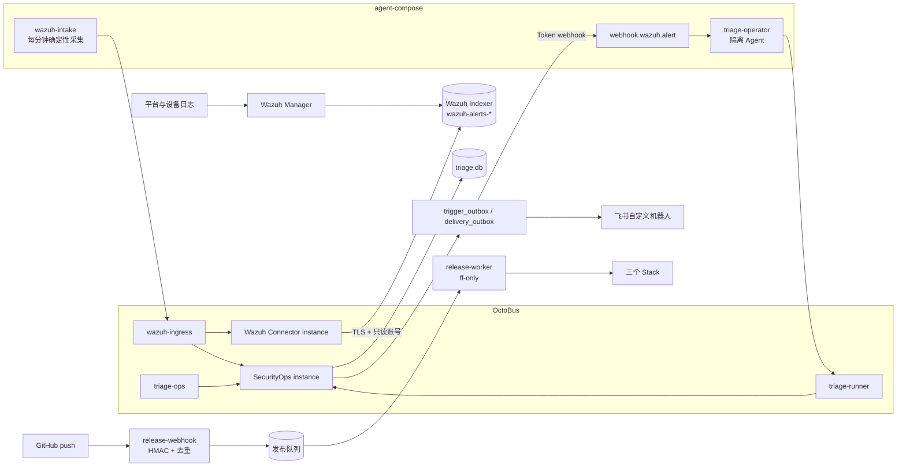
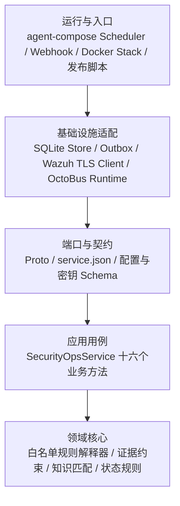
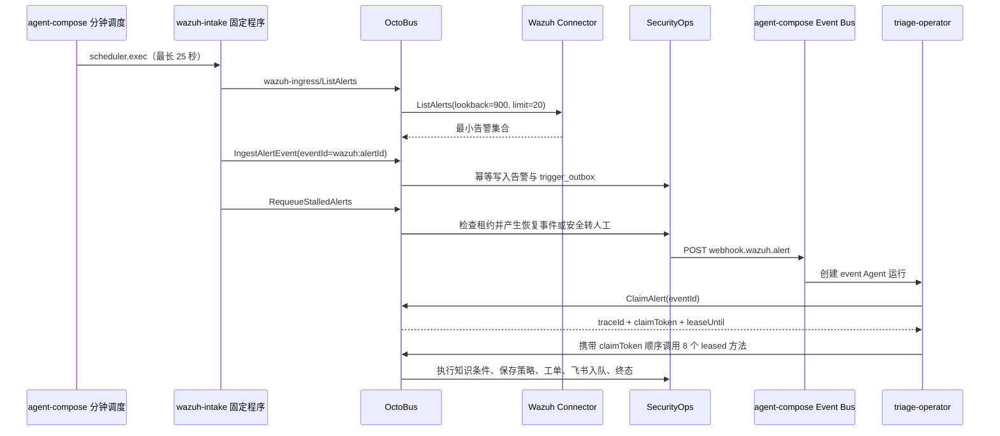
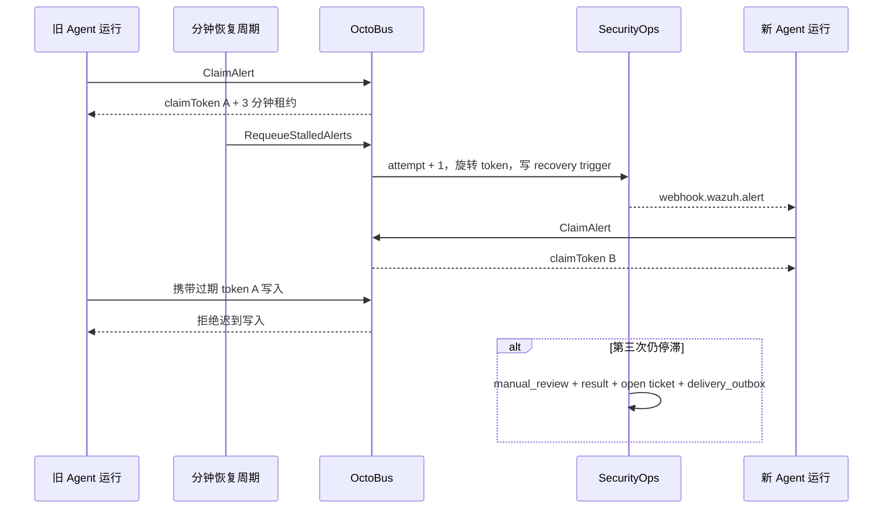

# Chaitin Triage Agent

基于 Wazuh、agent-compose、OctoBus、SQLite 和飞书 Webhook 的安全告警闭环。仓库面向车联网平台、物联网平台和工业互联网平台，支持分钟级 Wazuh 告警采集、agent-compose 原生事件触发、租约恢复、确定性研判、人工工单、飞书投递和全链路 trace。

当前开发分支为 `develop`。运行时只保留一条业务主链路：

```text
Wazuh -> OctoBus -> agent-compose Agent -> OctoBus -> SecurityOps -> SQLite/飞书
```

Agent 不直接访问 Wazuh、SQLite、飞书或任意业务 HTTP 服务。GitHub 发布 webhook 属于独立部署控制面，不进入 Agent 业务运行面。

## 1. 系统边界

| 组件 | 职责 | 明确不负责 |
| --- | --- | --- |
| Wazuh | 接收日志、执行解码与规则、把告警写入 `wazuh-alerts-*` | 不执行 Agent 研判 |
| Wazuh Connector | 使用只读账号和 TLS 查询 Wazuh Indexer API | 不写 Wazuh，不访问业务 SQLite |
| OctoBus | 托管 service/instance，按 capset 和 method 做精确授权，记录能力访问 | 不承载长耗时编排 |
| agent-compose | 运行分钟级确定性采集与 webhook 事件 Agent，并向隔离运行注入 MCP 工具 | 不保存业务终态，不直接调用外部业务服务 |
| SecurityOps | 告警幂等接入、可执行知识、确定性策略、工单、飞书 outbox、trace | 不查询 Wazuh，不调用模型 |
| SQLite | 保存 SecurityOps 单实例业务状态和审计记录 | 不保存 agent-compose/OctoBus 控制面数据 |
| release-webhook | 校验 GitHub HMAC，限定仓库/分支/SHA，持久化发布请求 | 不参与告警研判 |

SQLite 足以支持当前单实例闭环。agent-compose、OctoBus 和 SecurityOps 分别拥有自己的 SQLite，不共享文件、不跨服务直连；当前无需 PostgreSQL。

## 2. 总体架构



长期运行的 receiver 没有代码目录和 Docker Socket；只有不监听端口的 release-worker 持有部署权限。Wazuh 测试事件注入器仅向 Wazuh syslog 入口发送结构化测试事件，Agent 仍然从真实 `wazuh-alerts-*` 索引读取告警。

### 2.1 代码架构（洋葱架构）

代码采用“领域规则在内、编排用例居中、协议与基础设施适配在外”的洋葱架构，并叠加事件驱动入口。这里的分层按依赖职责划分，不要求每一层都成为单独进程：`SecurityOpsService` 负责用例编排，SQLite、Wazuh、飞书、OctoBus SDK 和 agent-compose 都是外层适配器。



依赖与数据访问规则：

- 内层规则不读取 Docker、Wazuh 或页面状态；确定性决策和证据门控由 SecurityOps 掌握，Agent 不能改写；
- `runtime.js` 是组合根，装配 Store、KnowledgeRepository、OutboxWorker 和 OctoBus SDK，不把基础设施对象暴露给 Agent；
- Wazuh Connector 只实现“TLS 只读查询并最小化返回字段”，不写业务库；
- scheduler 只拿到对应 capset 的 MCP 工具，不能直连 Wazuh、SQLite、飞书或任意业务 HTTP 接口；
- `trigger_outbox` 与 `delivery_outbox` 把事务写入和外部投递解耦，外部故障不会回滚已经确认的业务结果；
- `deploy/` 只负责装配、密钥渲染、能力注册和运行检查，不包含第二套业务实现。

### 2.2 代码目录与职责

```text
chaitin-triage-agent/
├── agent-compose.yml                 # Agent、模型、OctoBus catalog 与两个 trigger
├── scheduler/
│   ├── wazuh-intake.js               # 每分钟固定采集、幂等接入和租约恢复检查
│   └── triage-scheduler.js            # 事件 Agent 编排与结构化终态校验
├── services/
│   ├── wazuh-connector/              # 独立 OctoBus service：Wazuh TLS 只读适配器
│   └── security-ops/                 # 独立 OctoBus service：业务核心与持久化
│       ├── proto/                    # 入站能力契约
│       ├── src/service.js            # 应用用例与状态推进
│       ├── src/knowledge-rule-engine.js # 可执行知识的安全规则解释器
│       ├── src/knowledge-policy.js      # 规则结果到安全动作的确定性映射
│       ├── src/knowledge-repository.js
│       ├── src/store.js              # SQLite 适配器与迁移
│       ├── src/outbox.js             # Agent/飞书可靠投递适配器
│       └── src/runtime.js            # OctoBus SDK 入口与依赖装配
├── knowledge-authoring/              # 99 条知识、复核登记和 396 条边界测试记录
├── tools/
│   ├── wazuh-event-injector/         # 从 Wazuh syslog 入口写入验证事件
│   ├── release-webhook/              # GitHub HMAC 接收器与受限发布 worker
│   └── verify-repository.mjs         # 仓库统一验证入口
├── deploy/
│   ├── update-stacks.sh              # 备份、更新、注册和检查的统一入口
│   └── stacks/                       # 三个唯一 Stack 定义与配套脚本
└── docs/                             # 设计、ADR 和实施计划
```

测试跟随各模块存放在 `*/test/` 下，仓库根目录不保留空的占位目录。能力代码只存在于 `services/`，不再保留旧的重复能力目录。

## 3. 分钟采集、事件研判与租约恢复

### 3.1 分钟级确定性采集与事件驱动

`wazuh-intake` 使用 `* * * * *` 每分钟运行。它通过一次有界 `scheduler.exec` 启动固定程序，不调用模型、不接受任意命令，`concurrency_policy=skip` 与 `sandbox_policy=sticky` 防止同一个采集任务重叠。单次硬超时为 25 秒，空轮询目标为 5～10 秒并必须小于 30 秒。



固定采集程序只负责读取、接入和恢复检查，不在同一运行中执行研判。Wazuh Connector 只返回带 `triage_input` 规则组的安全运营告警，避免把 Wazuh 自身运维事件送入业务队列；它把 Indexer `_id` 当作不透明值，内部键不安全时使用稳定哈希，并在告警 JSON 的 `_triage_source` 中保留原始文档 ID 与索引名。接入事务提交后由 SecurityOps `trigger_outbox` 发布 agent-compose 事件，避免“告警已写入但事件丢失”。重复 Wazuh alert 使用稳定 `eventId=wazuh:<alertId>`，不会生成第二条业务记录；`status=pending` 或 `duplicate=true` 均表示本次接入调用成功。

`POST webhook.wazuh.alert` 是 agent-compose 官方事件入口，属于触发面，不包装成 OctoBus 业务方法。它只携带 `eventId` 和 `correlationId` 等不透明标识；事件 Agent 随后的告警上下文读取、状态推进、人工工单和通知入队全部通过 OctoBus `triage-runner`。因此简化数据流仍是 `Wazuh -> OctoBus -> agent-compose Agent -> OctoBus -> SecurityOps -> SQLite/飞书`，同时避免把 OctoBus 误用为事件总线。

Webhook 返回 `202` 或 agent-compose 事件状态变为 `published_to_bus` 只表示事件层已接收，不表示研判完成。业务完成必须以 SecurityOps 终态 trace 为准。领域、攻击类型提示、上下文和证据均由 SecurityOps 从 Wazuh 告警提取；`attack_type_id` 只用于候选排序，SecurityOps 会执行同领域知识条件，事件事实命中可覆盖错误提示。缺少领域或关键事实时固定进入人工分类或补证路径，Agent 不得自行补全。

### 3.2 租约、围栏与分钟级恢复



每个业务写入都校验当前 `claimToken` 并刷新租约。连续 3 分钟没有进展时，`RequeueStalledAlerts` 以新的恢复 attempt 重新投递；旧 token 随即失效，迟到运行不能覆盖新状态。第三次仍无法完成时由 SecurityOps 确定性地写入 `manual_review/request_additional_evidence`、人工工单和飞书待投递记录，不自动关闭事件。失败投递的人工恢复只属于 `triage-ops`。

## 4. OctoBus 能力拆分

仓库内包含两个可独立导入的 OctoBus service package：

- `services/wazuh-connector`：1 个 unary method，唯一外部数据源接口为 Wazuh Indexer API。
- `services/security-ops`：16 个 unary methods，拥有业务 SQLite、确定性策略、人工工单、飞书 outbox 和 worker readiness。

三个 capset 每个使用不同 token：

| capset | instance / method | 使用方 |
| --- | --- | --- |
| `wazuh-ingress` | `ListAlerts`、`IngestAlertEvent`、`RequeueStalledAlerts` | 分钟确定性采集程序 |
| `triage-runner` | `ClaimAlert` 及其后 8 个携带租约 token 的上下文、知识、策略、结果、工单、飞书入队与终态方法 | 事件研判 Agent |
| `triage-ops` | `GetTriageTrace`、`RecoverDelivery`、`PutAuthorizationRecord`、`GetWorkerReadiness` | 人工运维与验证 |

初始化脚本会先移除旧 instance binding，再用 `--no-all-methods` 和逐一 `select-method` 重建授权。service 后续新增方法不会自动暴露。

agent-compose 的每个 `octobus_servers` 条目只有一个服务端 token：它既用该 token 读取受保护的 OctoBus admin catalog 生成沙箱 MPI 能力说明，也用它代理对应 capset 的业务调用。因此初始化会把 `WAZUH_INGRESS_TOKEN` 和 `TRIAGE_RUNNER_TOKEN` 分别登记为同名 capset token 与 agent-compose 专用 admin token；二者仍彼此独立，也不同于 bootstrap 管理 token。它们只保存在 daemon 私有配置中，不进入 Agent 沙箱。`TRIAGE_OPS_TOKEN` 仅用于人工运维数据面，不登记为 admin token。

业务调用统一遵循：

```text
Agent -> MCP -> OctoBus capset -> instance -> service unary method
```

测试事件进入 Wazuh 的 syslog 是数据采集入口，不是 Agent 绕过 OctoBus 的业务调用。GitHub 发布 webhook 是隔离的部署控制面，也不向 Agent 暴露。

## 5. SecurityOps 状态与安全门控

SecurityOps 的 `triage.db` 位于其 OctoBus instance workdir。主要表包括：

- `ingress_events`、`trigger_outbox`：告警和事件投递；
- `triage_runs`、`alert_claims`、`triage_steps`：运行与证据链；
- `policy_decisions`：不可由 Agent 改写的确定性决定；
- `triage_results`：Agent 叙述和权威决定引用；
- `manual_tickets`：始终创建且保持 `open` 的人工工单；
- `delivery_outbox`：飞书投递、重试和人工恢复状态。

`MatchKnowledge` 和 `EvaluatePolicy` 都根据当前 `claimToken + traceId` 从已接入的 Wazuh 告警重新构造权威上下文，不接收 Agent 转抄的领域、事件类型、上下文或知识候选。`EvaluatePolicy` 在服务端重新执行已批准规则，把权威 decision、action 和 `evaluation_json` 写入 `policy_decisions`。`RecordTriageResult` 只接收 narrative，并在同一租约围栏内直接读取和绑定已保存策略；不再生成、返回或持久化需要模型转抄的第二套决策令牌。调用方即使额外提交 decision 或 action 也不能覆盖服务端结果。所有路径都满足：

- `ticketRequired=true`；
- `autoCloseAllowed=false`；
- 缺证据时进入 `request_additional_evidence`；
- 无匹配知识时进入 `manual_classification`；
- 飞书失败不会伪装成成功，超过重试上限进入人工恢复。

## 6. 三领域知识

`knowledge-authoring` 维护：

- 3 个领域：车联网平台、物联网平台、工业互联网平台；
- 33 个事件类型；
- 99 条领域知识；
- 396 条边界测试记录，每条知识覆盖证据充分、授权或良性、证据不足、复合或重复活动四类输入。

知识包含适用资产、协议、领域关注点、33 类攻击各自独立的可观测信号与证据、Wazuh 映射、所需遥测、反例、误报条件、漏报条件、绕过点和不可单独使用字段。每条记录还包含 `executableRule`：

- `requiredFacts`：缺失即转 `request_additional_evidence`；
- `confirmWhen`：由白名单字段路径和 `equals/in/gte/lte/contains_any/starts_with/truthy/exists` 等有限操作组成；
- `excludeWhen`：命中授权变更、受控测试、签名发布等反例时降噪，但仍创建人工工单；
- `thresholdBasis`：列出来源 ID、明确边界和部署后以已复核 Wazuh 告警及工单校准的规则。

例如车联网暴力破解要求五分钟内至少 8 次失败、影响至少 3 个账号；物联网为 10 次，工业互联网为 6 次。规则还要求领域和关键事实同时存在，有效换密授权优先排除。拒绝服务按领域容量基线分别使用每秒 800/500/300 次请求，并同时要求错误率至少 20% 和服务降级。这里的数值是保守初始边界，不宣称生产准确率；部署后必须依据人工复核记录滚动校准。单一 `rule.level`、来源地址、公开标准条目或事件类型提示都不能单独定性。

`sources.json` 登记 Wazuh 文档、MITRE ATT&CK/ICS、CAPEC、CWE、OWASP、CISA KEV、CNVD 工控、CNNVD、NISTIR 8259 和 UNECE R155 等核验入口。公开知识只提供攻击语义、观察点和外部核验线索，最终结果来自事件事实对本仓库可执行条件的命中。

运行知识只接受 `reviewStatus=approved` 且填写 `reviewedBy`、`reviewMarker`、`reviewedAt` 的记录。396 条边界用例用生产规则解释器逐条执行，并包含知识移除、排除条件移除和阈值边界消融测试；移除知识会使确认匹配消失。用例不进入运行知识包，也不作为历史事件数量或准确率。仓库不会自动替人工完成批准，也不提供批量模板生成器覆盖已复核知识。

## 7. 新服务器独立初始化

### 7.0 宿主机目录规划

业务运行数据和备份必须分开：

| 宿主机路径 | 用途 | 建议权限 |
| --- | --- | --- |
| `/data/chaitin/chaitin-triage-agent` | `develop` 分支 Git 工作区与三套 Stack 源文件 | 工作用户可读写，`.env` 单独 `0600` |
| `/data/chaitin/agent-compose` | agent-compose 控制面、沙箱和 UI 状态 | 仅 Docker 管理员维护 |
| `/data/chaitin/octobus` | OctoBus 状态和访问日志 | OctoBus uid 999 可写 |
| `/data/chaitin_backup/chaitin-triage-agent` | commit、私有配置和 SQLite 回滚材料 | `0700` 目录、`0600` 文件 |

初始化目录：

```sh
sudo install -d -o "$(id -u)" -g "$(id -g)" -m 0755 /data/chaitin
sudo install -d -o "$(id -u)" -g "$(id -g)" -m 0700 \
  /data/chaitin_backup /data/chaitin_backup/chaitin-triage-agent
```

不要把备份放回 `/data/chaitin`，也不要把 `/data/chaitin_backup` 挂载给 Wazuh、agent-compose、UI 或 OctoBus。只有无监听端口的 release-worker 具有该目录的写权限。统一更新脚本会拒绝位于业务状态根目录内部的 `--backup-root` 或 `UPDATE_STACKS_BACKUP_ROOT`，防止旧配置静默回退。

### 7.1 前提

- Linux `amd64`；
- Git、Docker Engine、Docker Compose v2；
- 至少 4 核 CPU、8 GiB 内存、30 GiB 可用磁盘；
- 可访问 GitHub、Docker Hub、GHCR、npm 和飞书；
- agent-compose 模型端点与凭据；
- GitHub webhook 对外入口必须经过 HTTPS 反向代理。

首次启动 Wazuh 前必须在宿主机设置 `vm.max_map_count=262144`；这是即时内核参数，不需要通过重启验证。

```sh
printf '%s\n' 'vm.max_map_count=262144' | sudo tee /etc/sysctl.d/99-chaitin-wazuh.conf >/dev/null
sudo sysctl --system
test "$(sysctl -n vm.max_map_count)" -ge 262144
```

镜像版本在 Stack 中固定。agent-compose、guest、UI 和 OctoBus 使用不可变 digest；Wazuh 使用官方 `4.14.7`，Node 使用 `22.23.2-alpine3.24`。

### 7.2 clone `develop`

```sh
cd /data/chaitin
git clone --branch develop --single-branch https://github.com/ch7pairsq/chaitin-triage-agent.git
cd chaitin-triage-agent
test "$(git branch --show-current)" = develop
git status --short
```

最后一条应无输出。

### 7.3 配置密钥

```sh
umask 077
cp .env.example .env
chmod 0600 .env
```

编辑 `.env`，至少完成：

- `REPO_ROOT=/data/chaitin/chaitin-triage-agent`；
- 模型 endpoint/key/model；
- OctoBus bootstrap admin、三个 capset、agent webhook、UI script token 使用互不相同且不少于 24 字符的随机值；其中初始化会按上一节所述为两个 agent-compose 项目 token 增加目录读取所需的服务端 admin 登记；
- UI auth secret、GitHub webhook secret 不少于 32 字符，各能力 token 不少于 24 字符；
- 四个 Wazuh 密码；
- 飞书自定义机器人 webhook 和可选签名 secret；
- 正确的 `GITHUB_REPOSITORY` 和 `RELEASE_DEPLOY_BRANCH=develop`。

`.env` 值使用单行文本，不提交、不粘贴到运行日志。生成后的私有文件位于各 Stack 的 `generated/`，均被 Git 忽略。

#### 凭据、账号和页面对应关系

| 配置项 | 账号或用途 | 明文/派生文件位置 | 页面或调用方 |
| --- | --- | --- | --- |
| `WAZUH_INDEXER_ADMIN_PASSWORD` | Indexer `admin`，只用于 Wazuh 内部连接、初始化只读角色和管理员登录 | 明文仅在根目录 `.env`；bcrypt 派生值在 `deploy/stacks/wazuh/generated/internal_users.yml` | Wazuh Dashboard 的管理员登录；业务 Agent 不使用 |
| `WAZUH_KIBANASERVER_PASSWORD` | `kibanaserver` 后端服务账号 | `.env`；bcrypt 派生值在 `internal_users.yml`；运行时进入 Dashboard 容器环境 | 不是人工登录账号 |
| `WAZUH_API_PASSWORD` | `wazuh-wui`，Dashboard 查询 Wazuh Manager API | `.env`；私有配置 `deploy/stacks/wazuh/generated/wazuh.yml` | 仅 Dashboard 后端使用 |
| `WAZUH_TRIAGE_READER_PASSWORD` | `triage_reader`，仅可读取 `wazuh-alerts-*` | `.env`；bcrypt 派生值在 `internal_users.yml`；明文运行副本在 `deploy/stacks/triage-platform/generated/wazuh-connector.secret.json` | 无页面；Wazuh Connector 通过 TLS 调用 Indexer |
| `AUTH_USERNAME`、`AUTH_PASSWORD` | agent-compose UI 登录 | `.env`，运行时进入 `agent-compose-ui` 容器环境 | `http://127.0.0.1:7412` |
| `AUTH_SECRET` | agent-compose UI 会话签名 | `.env`，运行时进入 `agent-compose-ui` 容器环境 | 不作为登录密码，不应输入页面 |
| `SCRIPT_SERVICE_TOKEN` | UI 到本地脚本服务的内部认证 | `.env`；`deploy/stacks/triage-platform/generated/script-service-token` | UI 内部使用，不作为人工登录凭据 |
| `LLM_API_KEY` | Agent 模型调用 | `.env`；`deploy/stacks/triage-platform/generated/agent-compose.env` | 仅 daemon 私有配置，不进入 Wazuh 或 Portainer 页面 |
| OctoBus 与 Agent webhook token | 分能力集授权和事件认证 | `.env`；`deploy/stacks/triage-platform/generated/` 下各 `0600` token/JSON 文件 | 无人工登录页面 |
| 飞书和 GitHub webhook secret | 通知签名与发布请求 HMAC | `.env`；分别进入 `security-ops.secret.json` 和 `release-webhook/generated/github-webhook-secret` | 无人工登录页面 |

Wazuh Connector 的 TLS 配置位于 `wazuh-connector.config.json`，固定使用 `https://wazuh.indexer:9200` 和 `root-ca.pem`，用户名固定为 `triage_reader`。`root-ca.pem` 是公开证书链验证材料，可为 `0444`；账号密码、私钥和所有 token 必须保持私密。

Portainer 的账号密码不属于本项目，不写入 `.env`。它由 Portainer 自身数据卷保存；当前标准宿主位置为 `/data/docker/volumes/portainer_data/_data/portainer.db`。Docker 管理员可以读取容器环境和 bind mount，因此仍应视为最高权限角色。

三个页面都只绑定服务器回环地址。通过本地 SSH 隧道访问时，把 `<私钥路径>` 和 `<服务器地址>` 替换为实际值：

```text
ssh -i "<私钥路径>" -N -L 7412:127.0.0.1:7412 -L 8443:127.0.0.1:8443 -L 9443:127.0.0.1:9443 root@<服务器地址>
```

- agent-compose UI：`http://127.0.0.1:7412`，使用 `AUTH_USERNAME/AUTH_PASSWORD`；
- Wazuh Dashboard：`https://127.0.0.1:8443`，使用 Wazuh `admin`；自签名证书首次访问会提示确认；
- Portainer：`https://127.0.0.1:9443`，使用 Portainer 自身账号；
- Wazuh Indexer `9200`、Manager API `55000` 和 release webhook `9080` 是接口端口，不作为日常人工页面。

### 7.4 源码与包验证

新服务器无需安装宿主机 Node，可使用固定 Node 镜像：

```sh
docker run --rm -v "$PWD:/repo" -w /repo node:22.23.2-alpine3.24 sh -ec '
  npm ci --prefix services/security-ops
  npm ci --prefix services/wazuh-connector
  npm run verify
'
```

期望所有测试通过，两个 service package 均能生成 descriptor、通过 SDK 包校验并完成 pack dry-run；仓库验证还会解析 `agent-compose.yml` 与三套 Stack 配置、检查部署端 JavaScript、实际生成一组临时私有配置，并在 Linux 容器内检查 Shell 语法。

### 7.5 人工复核并构建运行知识

先逐条复核 `knowledge-authoring/knowledge/*.json` 和 `knowledge-authoring/reviews.json` 中的检查项与批注，再填写批准状态、批准人和批准时间。完成后运行：

```sh
docker run --rm -v "$PWD:/repo" -w /repo/knowledge-authoring node:22.23.2-alpine3.24 sh -ec '
  npm run review:check
  npm run check
  npm test
  npm run build:runtime
'
test -s services/security-ops/resources/knowledge.jsonl
```

批准数量不是 99 时 `build:runtime` 必须失败；不要跳过该门控。

### 7.6 生成私有配置和 Wazuh 证书

```sh
/bin/sh deploy/stacks/triage-platform/prepare-config.sh
docker compose --env-file .env \
  -f deploy/stacks/wazuh/generate-indexer-certs.yml run --rm generator
/bin/sh deploy/stacks/wazuh/prepare-config.sh .env
```

检查文件存在但不要输出内容：

```sh
test -s deploy/stacks/wazuh/config/wazuh_indexer_ssl_certs/root-ca.pem
test "$(stat -c '%a' deploy/stacks/wazuh/config/wazuh_indexer_ssl_certs/root-ca.pem)" = 444
test -s deploy/stacks/wazuh/generated/internal_users.yml
test -s deploy/stacks/triage-platform/generated/security-ops.secret.json
docker compose --env-file .env -f deploy/stacks/wazuh/docker-compose.yml config --quiet
docker compose --env-file .env -f deploy/stacks/triage-platform/docker-compose.yml config --quiet
```

### 7.7 服务器脚本一次性初始化或更新

推荐在完成前述 clone、`.env`、知识构建与内核参数配置后，使用仓库统一入口：

```sh
/bin/sh deploy/update-stacks.sh
```

脚本先验证分支、干净工作树、配置文件和三套 Compose，再依次在 `/data/chaitin_backup/chaitin-triage-agent` 创建带 `backup` 与时间戳的提交、配置和 SQLite 备份，生成缺失证书，更新 Wazuh、triage-platform、能力注册与 release-webhook，最后执行状态验证。首次部署时允许各 `generated/` 目录尚不存在；已运行环境备份 SQLite 前会先停止 OctoBus 与 agent-compose，失败输出包含当前阶段和明确回滚点。

如采用 Portainer，可继续按 7.8～7.10 分别创建或更新 Stack；两条人工路径和签名 GitHub webhook 最终都使用仓库内同一组 Compose 文件及 `bootstrap.sh`，不维护第二份 Stack 定义。

### 7.8 启动 Wazuh Stack

命令行方式：

```sh
docker compose --env-file .env -f deploy/stacks/wazuh/docker-compose.yml up -d --build
docker ps --filter name=wazuh
docker wait wazuh-role-bootstrap
test "$(docker inspect --format '{{.State.ExitCode}}' wazuh-role-bootstrap)" = 0
```

Portainer 方式：新建 `chaitin-wazuh` Stack，使用本仓库 `deploy/stacks/wazuh/docker-compose.yml`，把 `.env` 中对应变量配置到 Stack environment。`REPO_ROOT` 必须指向本机 clone。启动后确认 manager、indexer、dashboard 正常，`wazuh-role-bootstrap` 以 0 退出。`root-ca.pem` 是公开验证材料，`prepare-config.sh` 将其设为 `0444`，以同时供 uid 1000 的 Wazuh 组件和 uid 999 的 OctoBus 能力进程只读使用；任何私钥权限都不会因此放宽。

Wazuh Dashboard 仅用于可视化，不参与告警采集、事件触发、研判或持久化主链路；不需要界面时可以不对外暴露其端口，但当前 Stack 保留该容器用于运维查看。

### 7.9 启动 triage-platform Stack 并导入能力

命令行方式：

```sh
docker compose --env-file .env -f deploy/stacks/triage-platform/docker-compose.yml up -d
docker compose --env-file .env -f deploy/stacks/triage-platform/docker-compose.yml \
  up -d --force-recreate agent-compose agent-compose-ui
/bin/sh deploy/stacks/triage-platform/bootstrap.sh
/bin/sh deploy/stacks/triage-platform/verify.sh
```

Portainer 方式：新建 `chaitin-triage-platform` Stack，使用 `deploy/stacks/triage-platform/docker-compose.yml`。每次同步新提交后都要重新部署 Stack，确保 agent-compose 的单文件只读挂载指向新文件；Stack 正常后仍需在宿主机执行一次 `bootstrap.sh`。脚本可重复执行，会更新两个 service、两个 instance、三个 capset、capset token、agent-compose 目录 token、agent-compose webhook source 和项目定义。

### 7.10 启动 release-webhook Stack

```sh
/bin/sh deploy/stacks/release-webhook/prepare-config.sh .env
docker compose --env-file .env -f deploy/stacks/release-webhook/docker-compose.yml config --quiet
docker compose --env-file .env -f deploy/stacks/release-webhook/docker-compose.yml up -d --build
docker compose --env-file .env -f deploy/stacks/release-webhook/docker-compose.yml ps
```

Portainer 使用 `deploy/stacks/release-webhook/docker-compose.yml` 新建 `chaitin-release-webhook`。默认只监听 `127.0.0.1:9080`；由现有 HTTPS 反向代理发布 `/webhooks/github`。GitHub 端只选择 `push`，Content type 为 `application/json`，Secret 与 `.env` 保持一致。

备份路径变更后必须重新创建 `release-worker`，仅在宿主机拉取代码不会更新容器已有的环境变量和 bind mount。在重建完成前，新版更新脚本会拒绝旧的业务目录备份路径，自动发布将安全失败而不会写错目录。

三个 Stack 的唯一文件如下，不要在 Portainer 中维护复制版：

| Portainer Stack 名称 | 仓库文件 | 更新后必须执行 |
| --- | --- | --- |
| `chaitin-wazuh` | `deploy/stacks/wazuh/docker-compose.yml` | 等待 `wazuh-role-bootstrap` 为 0 |
| `chaitin-triage-platform` | `deploy/stacks/triage-platform/docker-compose.yml` | `bootstrap.sh`，然后 `verify.sh` |
| `chaitin-release-webhook` | `deploy/stacks/release-webhook/docker-compose.yml` | 检查 receiver health 和 worker 运行状态 |

镜像版本由 Compose 文件控制。agent-compose、guest、UI 和 OctoBus 使用固定 digest，Wazuh 使用固定 `4.14.7`；不要在更新时手工改成 `latest`。`wazuh-event-injector` 与 `release-webhook` 从仓库内 Dockerfile 构建，因此这两个 Stack 更新时需要启用重新构建。

发布 worker 只接受 `develop` push；工作树不干净、origin 不匹配、远端最新 SHA 与事件 SHA 不一致或无法 fast-forward 时不会部署。失败记录保留在发布队列中。

GitHub 接收器使用原始请求体和 `X-Hub-Signature-256` 做 HMAC-SHA256 常量时间校验，并按 delivery ID 去重；只有仓库、`refs/heads/develop` 与提交 SHA 都匹配时才进入受限部署队列。接收器不挂载代码目录或 Docker Socket，实际 worker 仍调用同一个 `deploy/update-stacks.sh`。

## 8. 完整流程验证

### 8.1 快速状态检查

```sh
cd /data/chaitin/chaitin-triage-agent
/bin/sh deploy/stacks/triage-platform/verify.sh
```

该命令检查容器、Wazuh 最小权限角色初始化与 syslog 接收进程、agent-compose 版本与项目、`wazuh-intake` 和 `wazuh-alert` 两个 trigger、两个 OctoBus service、两个 instance、三个 MCP catalog，以及 SecurityOps worker readiness。readiness 会显示待重试积压、人工处理数量、最老待处理时长、当前批次和最近错误；旧调度器仍存在时检查失败。

### 8.2 连续 10 次空采集时延

没有新告警时连续执行 10 次正式分钟入口：

```sh
i=1
while [ "$i" -le 10 ]; do
  docker exec agent-compose agent-compose -p chaitin-triage-agent \
    scheduler invoke wazuh-intake --payload '{"mode":"cycle"}' --timeout 30s
  i=$((i + 1))
done
```

每次结果必须为 `success=true`、`polled=0` 或只包含已接入告警，并带非负的 `ingested`、`duplicates`、`requeued`、`manualized` 与 `durationMs`；每次均应在 30 秒内返回。手工入口使用 `scheduler invoke`，不创建另一套任务。

### 8.3 验证两次分钟级真实告警闭环

每一轮执行一次：

```sh
docker exec \
  -e INJECT_ENABLED=true \
  -e INJECT_ONCE=true \
  wazuh-event-injector node src/index.js
```

命令应返回 `status=sent` 和本轮 `eventId`。Wazuh 可能在下一次分钟轮询后才可查询，事件 Agent 的多轮模型编排通常还需要 1～3 分钟。使用以下命令查看外层状态，不把 webhook 已接收误当作业务完成：

```sh
docker exec agent-compose agent-compose -p chaitin-triage-agent \
  scheduler runs --trigger wazuh-intake --limit 3 --json
docker exec agent-compose agent-compose -p chaitin-triage-agent \
  scheduler runs --trigger wazuh-alert --limit 3 --json
```

在命令输出或 UI 中检查：

1. `wazuh-intake` 外层运行成功；
2. `wazuh-alert` 外层运行成功；
3. 内层 Agent JSON 的 `success=true`、`processed>=1`；
4. 记录返回的 `traceIds`，不使用占位符。

对每个真实 trace ID 执行：

```sh
/bin/sh deploy/stacks/triage-platform/verify-trace.sh '这里填写真实 trace ID'
```

该查询通过 `triage-ops` capset 调用 OctoBus，不直连数据库，并最多等待 90 秒确认外部投递。期望：

- `state=completed`；
- policy、result、open ticket、Feishu delivery 均存在；
- `ticketRequired=true`、`autoCloseAllowed=false`；
- `steps` 至少包含完整业务方法链；
- 飞书 delivery 已进入 `delivered`；仅写入 outbox 不算完整闭环。

第二轮必须获得不同的 Wazuh alert ID 和 trace ID。重复轮询同一个 alert 不应产生第二条业务记录。

### 8.4 恢复、并发、重复与飞书重试

本节包含主动中止运行、并发注入和临时改变飞书端点，仅允许在独立维护窗口执行；日常状态检查和两轮闭环不要执行这些故障注入。自动化测试已覆盖租约旋转、旧 token 围栏、最多两个活动研判、第三次停滞转人工以及飞书重试/转人工。

恢复验证使用一条专用事件，在 Agent 取得 claim 后中止该次运行，并保持 3 分钟不再写入。下一次 `wazuh-intake` 会通过 OctoBus 调用 `RequeueStalledAlerts`：前两次生成带递增 attempt 的恢复事件；旧运行继续使用原 claimToken 写入时必须被拒绝。第三次仍停滞时进入安全人工态，对该 trace 执行：

```sh
/bin/sh deploy/stacks/triage-platform/verify-trace.sh '这里填写恢复 trace ID' manual
```

结果必须包含非空 evidence、`state=manual`、`manual_review/request_additional_evidence`、open ticket 和明确的 delivery 状态。

并发验证连续注入 3 条不同告警，确认事件均进入 `trigger_outbox`，但 SecurityOps 同时处于 `claimed/processing` 的记录不超过 2；有空位后第三条继续处理。不要通过增加 Agent 并发数绕过服务端限制。

重复验证对同一个 Wazuh alert 连续运行两次采集入口，第二次 `duplicates` 增加且不生成新的 trace、工单或飞书 delivery。Webhook 重投使用相同 idempotency key，也只能触发同一业务事件。

飞书重试只在受控维护窗口使用可恢复的临时失败端点验证：先完成研判、结果和 open ticket，再确认 delivery 从 `pending` 经指数退避重试；临时错误解除后应变为 `delivered`。非重试错误或第 9 次失败进入 `manual`，由运维通过 `triage-ops/RecoverDelivery(includeManual=true)` 恢复，禁止绕过 outbox 直接发送。业务 `state=completed` 与飞书投递确认是两个独立状态，通知失败不得删除或回滚 result 和 ticket。

### 8.5 OctoBus 访问证据

```sh
cd /data/chaitin/chaitin-triage-agent
docker exec --env-file deploy/stacks/triage-platform/generated/octobus-admin.env \
  octobus octobus logs --capset wazuh-ingress --tail 50

docker exec --env-file deploy/stacks/triage-platform/generated/octobus-admin.env \
  octobus octobus logs --capset triage-runner --tail 100
```

同一运行窗口应看到分钟程序通过 `wazuh-ingress` 调用 `ListAlerts`、`IngestAlertEvent`、`RequeueStalledAlerts`，事件 Agent 通过 `triage-runner` 调用从 `ClaimAlert` 到 `FinalizeTriage` 的完整顺序。精确业务关联以 Agent run 返回的 trace ID 和 `verify-trace.sh` 为准。

### 8.6 提交、备份和 Stack 定义核验

```sh
cd /data/chaitin/chaitin-triage-agent
test "$(git branch --show-current)" = develop
git status --short
git rev-parse HEAD
git rev-parse origin/develop

test -d /data/chaitin_backup/chaitin-triage-agent
test "$(stat -c '%a' /data/chaitin_backup/chaitin-triage-agent)" = 700
find /data/chaitin_backup/chaitin-triage-agent -maxdepth 1 -type f \
  -name '*-backup-*' -printf '%f\n' | sort

docker compose --env-file .env -f deploy/stacks/wazuh/docker-compose.yml config --quiet
docker compose --env-file .env -f deploy/stacks/triage-platform/docker-compose.yml config --quiet
docker compose --env-file .env -f deploy/stacks/release-webhook/docker-compose.yml config --quiet
```

`git status --short` 应无输出，两个提交值应一致，三条 Compose 检查都应以 0 退出。备份目录中每个更新文件名都必须包含 `backup-YYYYMMDD-HHMMSS`；不要输出备份归档内容。

## 9. Portainer 更新顺序

提交进入 `develop` 后，release-webhook 会校验 HMAC 并尝试自动 fast-forward 和部署。人工更新 Portainer 时保持相同顺序：

1. 宿主机 `git fetch` 并确认工作树干净；
2. fast-forward 到 `origin/develop`；
3. 重新运行三个 Stack 的 `prepare-config.sh`；
4. 更新 `chaitin-wazuh`；
5. 更新 `chaitin-triage-platform`；
6. 确认 `agent-compose` 与 `agent-compose-ui` 已重新创建，再执行 `bootstrap.sh`；
7. 更新 `chaitin-release-webhook`；
8. 执行 `verify.sh`，再按第 8 章完成两轮业务验证。

不要删除持久卷，不要把 `.env`、`generated/` 或 `/data/chaitin_backup` 内容粘贴到 Stack YAML。

不使用 Portainer 时，服务器人工更新统一执行 `/bin/sh deploy/update-stacks.sh`；它与 Portainer、签名 webhook 路径引用完全相同的三个 Compose 文件，并自动在 `/data/chaitin_backup/chaitin-triage-agent` 生成带 `backup` 和时间戳的回滚材料。

## 10. 故障定位

| 现象 | 优先检查 |
| --- | --- |
| Wazuh 无告警 | manager 规则、Filebeat、Indexer `wazuh-alerts-*`、测试事件注入输出 |
| 分钟轮询失败 | `wazuh-ingress` catalog、Wazuh Connector instance、CA 和 `triage_reader` 角色 |
| 事件未触发 | SecurityOps `trigger_outbox` 状态、agent-compose `wazuh` webhook source、Token |
| 研判方法不可用 | `triage-runner` method binding，不要扩大为全部方法 |
| 结果写入被拒绝 | `claimToken` 是否仍在租约内、trace 是否一致、是否已先完成 `EvaluatePolicy` |
| 飞书未收到 | delivery 状态、Webhook 域名、签名 secret、429/5xx 重试；不要直接绕过 outbox 重发 |
| 租约恢复异常 | `wazuh-intake` 输出中的 `requeued/manualized`、`RequeueStalledAlerts` 审计、claimToken attempt 与旧 token 拒绝记录 |
| worker readiness 异常 | backlog、oldest pending age、active batch、last error；先恢复外部依赖，再通过 `triage-ops` 处理人工投递 |
| 发布不执行 | HMAC、delivery ID、仓库/分支、工作树、origin、远端 SHA、fast-forward 条件 |

设计依据和实现顺序见：

- `docs/design/2026-09-security-ops-rearchitecture.md`
- `docs/adr/0001-deterministic-intake-and-leased-triage.md`
- `docs/adr/0002-separate-backup-root.md`
- `docs/plans/2026-09-02-executable-operational-knowledge.md`
- [OctoBus overview](https://github.com/chaitin/OctoBus/blob/main/docs/design/overview.md)
- [OctoBus operations](https://github.com/chaitin/OctoBus/blob/main/docs/design/product/operations.md)
- [OctoBus CLI](https://github.com/chaitin/OctoBus/blob/main/docs/design/product/cli.md)
- [agent-compose design](https://github.com/chaitin/agent-compose/blob/main/docs/design/agent-compose_design.md)
- [agent-compose runtime contract](https://github.com/chaitin/agent-compose/blob/main/docs/design/agent-compose-runtime_contract.md)
- [agent-compose webhook design](https://github.com/chaitin/agent-compose/blob/main/docs/design/webhook_design.md)
