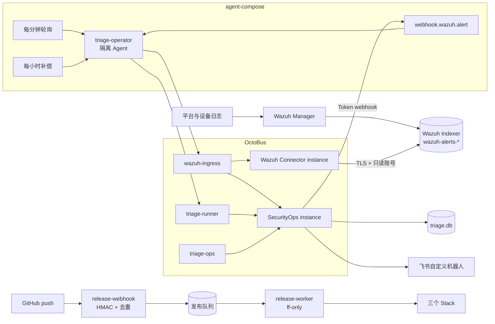
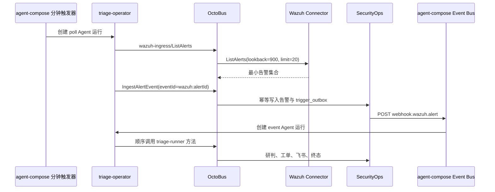
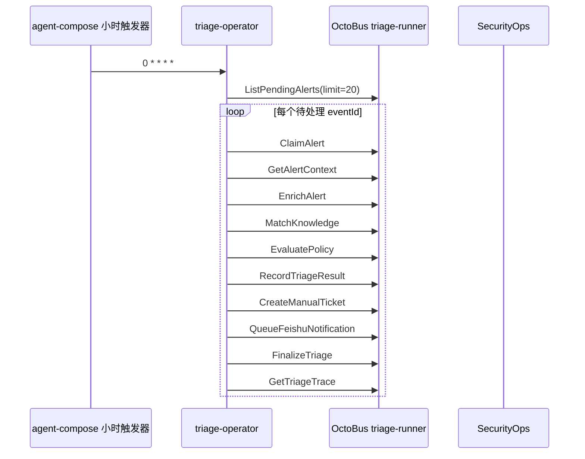

# Chaitin Triage Agent

基于 Wazuh、agent-compose、OctoBus、SQLite 和飞书 Webhook 的安全告警闭环。仓库面向车联网平台、物联网平台和工业互联网平台，支持分钟级 Wazuh 告警轮询、agent-compose 原生事件触发、小时级补偿、确定性研判、人工工单、飞书投递和全链路 trace。

当前开发分支为 `develop`。运行时只保留一条业务主链路：

```text
Wazuh -> OctoBus -> agent-compose Agent -> OctoBus -> SecurityOps -> SQLite/飞书
```

Agent 不直接访问 Wazuh、SQLite、飞书或任意业务 HTTP 服务。GitHub 发布 webhook 属于独立部署控制面，不进入 Agent 业务运行面。

## 1. 系统边界

| 组件 | 职责 | 明确不负责 |
| --- | --- | --- |
| Wazuh | 接收日志、执行解码与规则、把告警写入 `wazuh-alerts-*` | 不执行 Agent 研判 |
| Wazuh Connector | 使用只读账号和 TLS 查询 Wazuh Indexer API | 不写 Wazuh，不访问业务 SQLite |
| OctoBus | 托管 service/instance，按 capset 和 method 做精确授权，记录能力访问 | 不承载长耗时编排 |
| agent-compose | 注册分钟、事件、小时触发器；每次创建隔离 Agent 运行并注入 MCP 工具 | 不保存业务终态，不直接调用外部业务服务 |
| SecurityOps | 告警幂等接入、证据匹配、确定性策略、工单、飞书 outbox、trace | 不查询 Wazuh，不调用模型 |
| SQLite | 保存 SecurityOps 单实例业务状态和审计记录 | 不保存 agent-compose/OctoBus 控制面数据 |
| release-webhook | 校验 GitHub HMAC，限定仓库/分支/SHA，持久化发布请求 | 不参与告警研判 |

SQLite 足以支持当前单实例闭环。agent-compose、OctoBus 和 SecurityOps 分别拥有自己的 SQLite，不共享文件、不跨服务直连；当前无需 PostgreSQL。

## 2. 总体架构



长期运行的 receiver 没有代码目录和 Docker Socket；只有不监听端口的 release-worker 持有部署权限。Wazuh 测试事件注入器仅向 Wazuh syslog 入口发送结构化测试事件，Agent 仍然从真实 `wazuh-alerts-*` 索引读取告警。

## 3. 两条业务触发路径

### 3.1 分钟轮询与事件驱动



轮询 Agent 只读取和接入，不在同一运行中继续研判。接入事务提交后由 SecurityOps outbox 发布 agent-compose 事件，避免“告警已写入但事件丢失”。重复 Wazuh alert 使用稳定 `eventId=wazuh:<alertId>`，不会生成第二条业务记录。

Webhook 返回 `202` 或 agent-compose 事件状态变为 `published_to_bus` 只表示事件层已接收，不表示研判完成。业务完成必须以 SecurityOps 终态 trace 为准；事件运行中断后，小时任务会重新取得 `pending` 或仍处于 `processing` 的未完成事件，并沿同一幂等链继续执行。领域、攻击类型、上下文和证据均由 SecurityOps 从 Wazuh 告警提取；缺少可信分类时固定进入 `unclassified/other_attack` 人工分类路径，Agent 不得自行补全。

### 3.2 小时级补偿



小时任务与事件任务使用相同幂等业务方法。它不拥有 `RecoverDelivery`；失败投递的人工恢复只属于 `triage-ops`。

## 4. OctoBus 能力拆分

仓库内包含两个可独立导入的 OctoBus service package：

- `services/wazuh-connector`：1 个 unary method，唯一外部数据源接口为 Wazuh Indexer API。
- `services/security-ops`：13 个 unary methods，拥有业务 SQLite、确定性策略、人工工单和飞书 outbox。

三个 capset 每个使用不同 token：

| capset | instance / method | 使用方 |
| --- | --- | --- |
| `wazuh-ingress` | `WazuhConnector/ListAlerts`、`SecurityOps/IngestAlertEvent` | 分钟轮询 Agent |
| `triage-runner` | 待处理查询、claim、上下文、知识、策略、结果、工单、飞书、终态、trace | 事件与小时 Agent |
| `triage-ops` | `GetTriageTrace`、`RecoverDelivery` | 人工运维 |

初始化脚本会先移除旧 instance binding，再用 `--no-all-methods` 和逐一 `select-method` 重建授权。service 后续新增方法不会自动暴露。

agent-compose 的每个 `octobus_servers` 条目只有一个服务端 token：它既用该 token 读取受保护的 OctoBus admin catalog 生成沙箱 MPI 能力说明，也用它代理对应 capset 的业务调用。因此初始化会把 `WAZUH_INGRESS_TOKEN` 和 `TRIAGE_RUNNER_TOKEN` 分别登记为同名 capset token 与 agent-compose 专用 admin token；二者仍彼此独立，也不同于 bootstrap 管理 token。它们只保存在 daemon 私有配置中，不进入 Agent 沙箱。`TRIAGE_OPS_TOKEN` 仅用于人工运维数据面，不登记为 admin token。

业务调用统一遵循：

```text
Agent -> MCP -> OctoBus capset -> instance -> service unary method
```

测试事件进入 Wazuh 的 syslog 是数据采集入口，不是 Agent 绕过 OctoBus 的业务调用。GitHub 发布 webhook 是隔离的部署控制面，也不向 Agent 暴露。

## 5. SecurityOps 状态与安全门控

SecurityOps 的 `triage.db` 位于其 OctoBus instance workdir。主要表包括：

- `alert_ingress`、`trigger_outbox`：告警和事件投递；
- `triage_runs`、`triage_claims`、`triage_steps`：运行与证据链；
- `policy_decisions`：不可由 Agent 改写的确定性决定；
- `triage_results`：Agent 叙述和权威决定引用；
- `manual_tickets`：始终创建且保持 `open` 的人工工单；
- `delivery_outbox`：飞书投递、重试和人工恢复状态。

`EvaluatePolicy` 返回带 HMAC 的 `decisionToken`。`RecordTriageResult` 必须原样提交该 token；修改 decision、action、evidence 或 trace 会被拒绝。所有路径都满足：

- `ticketRequired=true`；
- `autoCloseAllowed=false`；
- 缺证据时进入 `request_additional_evidence`；
- 无匹配知识时进入 `manual_classification`；
- 飞书失败不会伪装成成功，超过重试上限进入人工恢复。

## 6. 三领域知识

`knowledge-authoring` 维护：

- 3 个领域：车联网平台、物联网平台、工业互联网平台；
- 33 个事件类型；
- 99 条领域知识；
- 396 条边界测试记录，每条知识覆盖证据充分、授权或良性、证据不足、复合或重复活动四类输入。

知识包含适用资产、协议、领域关注点、33 类攻击各自独立的可观测信号与证据、Wazuh 映射、所需遥测、反例、误报条件、漏报条件、绕过点和不可单独使用字段。单一 `rule.level` 或单一来源地址不得完成定性；当前使用多源证据门控，不把未经数据校准的风险分数包装成有效阈值。

运行知识只接受 `reviewStatus=approved` 且填写 `reviewedBy`、`reviewMarker`、`reviewedAt` 的记录。396 条边界测试记录不进入运行知识包，也不作为历史事件数量。仓库不会自动替人工完成批准。

## 7. 新服务器独立初始化

### 7.1 前提

- Linux `amd64`；
- Git、Docker Engine、Docker Compose v2；
- 至少 4 核 CPU、8 GiB 内存、30 GiB 可用磁盘；
- 可访问 GitHub、Docker Hub、GHCR、npm 和飞书；
- agent-compose 模型端点与凭据；
- GitHub webhook 对外入口必须经过 HTTPS 反向代理。

首次启动 Wazuh 前必须在宿主机设置 `vm.max_map_count=262144`；这是即时内核参数，不需要通过重启验证。

```sh
printf '%s\n' 'vm.max_map_count=262144' | sudo tee /etc/sysctl.d/99-chaitin-wazuh.conf >/dev/null
sudo sysctl --system
test "$(sysctl -n vm.max_map_count)" -ge 262144
```

镜像版本在 Stack 中固定。agent-compose、guest、UI 和 OctoBus 使用不可变 digest；Wazuh 使用官方 `4.14.7`，Node 使用 `22.23.2-alpine3.24`。

### 7.2 clone `develop`

```sh
sudo mkdir -p /data/chaitin
sudo chown "$(id -u):$(id -g)" /data/chaitin
cd /data/chaitin
git clone --branch develop --single-branch https://github.com/ch7pairsq/chaitin-triage-agent.git
cd chaitin-triage-agent
test "$(git branch --show-current)" = develop
git status --short
```

最后一条应无输出。

### 7.3 配置密钥

```sh
umask 077
cp .env.example .env
chmod 0600 .env
```

编辑 `.env`，至少完成：

- `REPO_ROOT=/data/chaitin/chaitin-triage-agent`；
- 模型 endpoint/key/model；
- OctoBus bootstrap admin、三个 capset、agent webhook、UI script token 使用互不相同且不少于 24 字符的随机值；其中初始化会按上一节所述为两个 agent-compose 项目 token 增加目录读取所需的服务端 admin 登记；
- decision secret、UI auth secret、GitHub webhook secret 不少于 32 字符；
- 四个 Wazuh 密码；
- 飞书自定义机器人 webhook 和可选签名 secret；
- 正确的 `GITHUB_REPOSITORY` 和 `RELEASE_DEPLOY_BRANCH=develop`。

`.env` 值使用单行文本，不提交、不粘贴到运行日志。生成后的私有文件位于各 Stack 的 `generated/`，均被 Git 忽略。

### 7.4 源码与包验证

新服务器无需安装宿主机 Node，可使用固定 Node 镜像：

```sh
docker run --rm -v "$PWD:/repo" -w /repo node:22.23.2-alpine3.24 sh -ec '
  npm ci --prefix services/security-ops
  npm ci --prefix services/wazuh-connector
  npm run verify
'
```

期望所有测试通过，两个 service package 均能生成 descriptor、通过 SDK 包校验并完成 pack dry-run；仓库验证还会解析 `agent-compose.yml` 与三套 Stack 配置、检查部署端 JavaScript、实际生成一组临时私有配置，并在 Linux 容器内检查 Shell 语法。

### 7.5 人工复核并构建运行知识

先逐条复核 `knowledge-authoring/knowledge/*.json` 和 `knowledge-authoring/reviews.json` 中的检查项与批注，再填写批准状态、批准人和批准时间。完成后运行：

```sh
docker run --rm -v "$PWD:/repo" -w /repo/knowledge-authoring node:22.23.2-alpine3.24 sh -ec '
  npm run generate
  npm run review:check
  npm run check
  npm test
  npm run build:runtime
'
test -s services/security-ops/resources/knowledge.jsonl
```

批准数量不是 99 时 `build:runtime` 必须失败；不要跳过该门控。

### 7.6 生成私有配置和 Wazuh 证书

```sh
/bin/sh deploy/stacks/triage-platform/prepare-config.sh
docker compose --env-file .env \
  -f deploy/stacks/wazuh/generate-indexer-certs.yml run --rm generator
/bin/sh deploy/stacks/wazuh/prepare-config.sh .env
```

检查文件存在但不要输出内容：

```sh
test -s deploy/stacks/wazuh/config/wazuh_indexer_ssl_certs/root-ca.pem
test -s deploy/stacks/wazuh/generated/internal_users.yml
test -s deploy/stacks/triage-platform/generated/security-ops.secret.json
docker compose --env-file .env -f deploy/stacks/wazuh/docker-compose.yml config --quiet
docker compose --env-file .env -f deploy/stacks/triage-platform/docker-compose.yml config --quiet
```

### 7.7 启动 Wazuh Stack

命令行方式：

```sh
docker compose --env-file .env -f deploy/stacks/wazuh/docker-compose.yml up -d --build
docker ps --filter name=wazuh
docker wait wazuh-role-bootstrap
test "$(docker inspect --format '{{.State.ExitCode}}' wazuh-role-bootstrap)" = 0
```

Portainer 方式：新建 `chaitin-wazuh` Stack，使用本仓库 `deploy/stacks/wazuh/docker-compose.yml`，把 `.env` 中对应变量配置到 Stack environment。`REPO_ROOT` 必须指向本机 clone。启动后确认 manager、indexer、dashboard 正常，`wazuh-role-bootstrap` 以 0 退出。

### 7.8 启动 triage-platform Stack 并导入能力

命令行方式：

```sh
docker compose --env-file .env -f deploy/stacks/triage-platform/docker-compose.yml up -d
docker compose --env-file .env -f deploy/stacks/triage-platform/docker-compose.yml \
  up -d --force-recreate agent-compose agent-compose-ui
/bin/sh deploy/stacks/triage-platform/bootstrap.sh
/bin/sh deploy/stacks/triage-platform/verify.sh
```

Portainer 方式：新建 `chaitin-triage-platform` Stack，使用 `deploy/stacks/triage-platform/docker-compose.yml`。每次同步新提交后都要重新部署 Stack，确保 agent-compose 的单文件只读挂载指向新文件；Stack 正常后仍需在宿主机执行一次 `bootstrap.sh`。脚本可重复执行，会更新两个 service、两个 instance、三个 capset、capset token、agent-compose 目录 token、agent-compose webhook source 和项目定义。

### 7.9 启动 release-webhook Stack

```sh
/bin/sh deploy/stacks/release-webhook/prepare-config.sh .env
docker compose --env-file .env -f deploy/stacks/release-webhook/docker-compose.yml config --quiet
docker compose --env-file .env -f deploy/stacks/release-webhook/docker-compose.yml up -d --build
docker compose --env-file .env -f deploy/stacks/release-webhook/docker-compose.yml ps
```

Portainer 使用 `deploy/stacks/release-webhook/docker-compose.yml` 新建 `chaitin-release-webhook`。默认只监听 `127.0.0.1:9080`；由现有 HTTPS 反向代理发布 `/webhooks/github`。GitHub 端只选择 `push`，Content type 为 `application/json`，Secret 与 `.env` 保持一致。

发布 worker 只接受 `develop` push；工作树不干净、origin 不匹配、远端最新 SHA 与事件 SHA 不一致或无法 fast-forward 时不会部署。失败记录保留在发布队列中。

## 8. 完整流程验证

### 8.1 快速状态检查

```sh
/bin/sh deploy/stacks/triage-platform/verify.sh
```

该命令检查容器、Wazuh 最小权限角色初始化、agent-compose 版本与项目、三个 scheduler trigger、两个 OctoBus service、两个 instance、两个 agent-compose 目录 token 登记和三个 MCP catalog。

### 8.2 验证两次分钟级真实告警闭环

每一轮执行一次：

```sh
docker exec \
  -e INJECT_ENABLED=true \
  -e INJECT_ONCE=true \
  wazuh-event-injector node src/index.js
```

命令应返回 `status=sent` 和本轮 `eventId`。随后等待分钟轮询、Wazuh 索引、事件触发和 Agent 运行完成。在 UI 中检查：

1. `wazuh-alert-poll` 外层运行成功；
2. `wazuh-alert` 外层运行成功；
3. 内层 Agent JSON 的 `success=true`、`processed>=1`；
4. 记录返回的 `traceIds`，不使用占位符。

对每个真实 trace ID 执行：

```sh
/bin/sh deploy/stacks/triage-platform/verify-trace.sh '这里填写真实 trace ID'
```

该查询通过 `triage-ops` capset 调用 OctoBus，不直连数据库，并最多等待 90 秒确认外部投递。期望：

- `state=completed`；
- policy、result、open ticket、Feishu delivery 均存在；
- `ticketRequired=true`、`autoCloseAllowed=false`；
- `steps` 至少包含完整业务方法链；
- 飞书 delivery 已进入 `delivered`；仅写入 outbox 不算完整闭环。

第二轮必须获得不同的 Wazuh alert ID 和 trace ID。重复轮询同一个 alert 不应产生第二条业务记录。

### 8.3 验证两次小时级任务

无需等待整点，可手工触发同一个正式 trigger：

```sh
docker exec agent-compose agent-compose -p chaitin-triage-agent \
  scheduler trigger triage-operator hourly-security-triage

docker exec agent-compose agent-compose -p chaitin-triage-agent \
  scheduler trigger triage-operator hourly-security-triage
```

再查询历史：

```sh
docker exec agent-compose agent-compose -p chaitin-triage-agent \
  scheduler runs triage-operator --trigger hourly-security-triage --limit 10
```

两次运行都应成功。没有待处理告警时 `processed=0` 是正常结果；若有待处理告警，仍应沿用同一幂等链路，不得生成重复工单。

### 8.4 OctoBus 访问证据

```sh
docker exec --env-file deploy/stacks/triage-platform/generated/octobus-admin.env \
  octobus octobus logs --capset wazuh-ingress --tail 50

docker exec --env-file deploy/stacks/triage-platform/generated/octobus-admin.env \
  octobus octobus logs --capset triage-runner --tail 100
```

同一运行窗口应看到 `ListAlerts`、`IngestAlertEvent` 和完整 SecurityOps 方法序列。精确业务关联以 Agent run 返回的 trace ID 和 `verify-trace.sh` 为准。

## 9. Portainer 更新顺序

提交进入 `develop` 后，release-webhook 会校验 HMAC 并尝试自动 fast-forward 和部署。人工更新 Portainer 时保持相同顺序：

1. 宿主机 `git fetch` 并确认工作树干净；
2. fast-forward 到 `origin/develop`；
3. 重新运行三个 Stack 的 `prepare-config.sh`；
4. 更新 `chaitin-wazuh`；
5. 更新 `chaitin-triage-platform`；
6. 确认 `agent-compose` 与 `agent-compose-ui` 已重新创建，再执行 `bootstrap.sh`；
7. 更新 `chaitin-release-webhook`；
8. 执行 `verify.sh`，再按第 8 章完成两轮业务验证。

不要删除持久卷，不要把 `.env` 或 `generated/` 内容粘贴到 Stack YAML。

## 10. 故障定位

| 现象 | 优先检查 |
| --- | --- |
| Wazuh 无告警 | manager 规则、Filebeat、Indexer `wazuh-alerts-*`、测试事件注入输出 |
| 分钟轮询失败 | `wazuh-ingress` catalog、Wazuh Connector instance、CA 和 `triage_reader` 角色 |
| 事件未触发 | SecurityOps `trigger_outbox` 状态、agent-compose `wazuh` webhook source、Token |
| 研判方法不可用 | `triage-runner` method binding，不要扩大为全部方法 |
| 决策写入被拒绝 | `decisionToken` 是否原样传递，trace 是否一致 |
| 飞书未收到 | delivery 状态、Webhook 域名、签名 secret、429/5xx 重试；不要直接绕过 outbox 重发 |
| 小时任务失败 | 使用 `scheduler trigger triage-operator hourly-security-triage`，不要把 shell 占位符传入 Agent |
| 发布不执行 | HMAC、delivery ID、仓库/分支、工作树、origin、远端 SHA、fast-forward 条件 |

设计依据和实现顺序见：

- `docs/design/2026-09-security-ops-rearchitecture.md`
- `docs/plans/2026-09-01-security-ops-implementation.md`
- [OctoBus overview](https://github.com/chaitin/OctoBus/blob/main/docs/design/overview.md)
- [OctoBus operations](https://github.com/chaitin/OctoBus/blob/main/docs/design/product/operations.md)
- [OctoBus CLI](https://github.com/chaitin/OctoBus/blob/main/docs/design/product/cli.md)
- [agent-compose design](https://github.com/chaitin/agent-compose/blob/main/docs/design/agent-compose_design.md)
- [agent-compose runtime contract](https://github.com/chaitin/agent-compose/blob/main/docs/design/agent-compose-runtime_contract.md)
- [agent-compose webhook design](https://github.com/chaitin/agent-compose/blob/main/docs/design/webhook_design.md)
